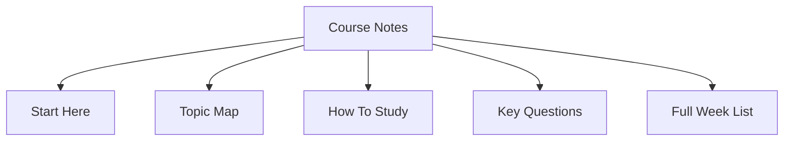

# Course Notes

These notes cover Applied Human-Computer Interaction from foundations to requirements, prototyping, design rules, usability goals, bad design analysis, and evaluation methods.

## Start Here

  <a class="week-card" href="week-1/">
    <strong>Week 1: HCI Foundations</strong>
    Interaction design, usability, design principles, devices, and paradigms.
  </a>
  <a class="week-card" href="week-2/">
    <strong>Week 2: Cognitive Aspects</strong>
    Attention, perception, memory, learning, mental models, and cognition in context.
  </a>
  <a class="week-card" href="week-3/">
    <strong>Week 3: Models and Styles</strong>
    Interaction models, ergonomics, interaction styles, and WIMP interfaces.
  </a>
  <a class="week-card" href="week-4/">
    <strong>Week 4: Design Process</strong>
    User involvement, needs, alternatives, evaluation, and agile integration.
  </a>
  <a class="week-card" href="week-5/">
    <strong>Week 5: Requirements</strong>
    Requirement types, data gathering, personas, scenarios, design fiction, and use cases.
  </a>
  <a class="week-card" href="week-8/">
    <strong>Week 8: Prototyping</strong>
    Co-design, community design, low/high fidelity prototypes, wireframes, and metaphors.
  </a>
  <a class="week-card" href="week-10/">
    <strong>Week 10: Practical Design</strong>
    Navigation, screen layout, controls, affordances, presentation, and iteration.
  </a>
  <a class="week-card" href="week-11/">
    <strong>Week 11: Design Rules</strong>
    Usability principles, patterns, standards, accessibility, consistency, and feedback.
  </a>
  <a class="week-card" href="week-12/">
    <strong>Week 12: Goals and Measures</strong>
    User control, error prevention, usability goals, UX goals, and measurement.
  </a>
  <a class="week-card" href="week-13/">
    <strong>Week 13: Bad Design</strong>
    UI mistakes, dark patterns, accessibility issues, best practices, and conversion.
  </a>
  <a class="week-card" href="week-14/">
    <strong>Week 14: Evaluation</strong>
    Usability testing, field studies, A/B testing, inspections, models, validity, and ethics.
  </a>

## Topic Map

### Foundations

- [HCI foundations and design principles](week-1/)
- [Human cognition and mental models](week-2/)
- [Interaction models and interaction styles](week-3/)

### Design Process

- [Interaction design process](week-4/)
- [Requirements discovery](week-5/)
- [Designing with people and prototyping](week-8/)
- [Practical interface design](week-10/)

### Rules and Evaluation

- [Design rules and usability principles](week-11/)
- [Usability and UX goals](week-12/)
- [Bad design analysis and best practices](week-13/)
- [Evaluation methods and ethics](week-14/)

## How To Study

Read each week in order, then use the linked topic pages for review. Focus on definitions, examples, and design implications. HCI concepts are most useful when you can apply them to real interfaces, not only repeat the terms.

## Key Questions

- Who are the users?
- What goals are they trying to achieve?
- What context are they working in?
- What actions does the interface make possible?
- What feedback does the system provide?
- Where can errors, confusion, or unnecessary effort occur?
- How can design be evaluated with evidence?

## Full Week List

- [Week 1: HCI Foundations](week-1/)
- [Week 2: Cognitive Aspects](week-2/)
- [Week 3: Interaction Models and Styles](week-3/)
- [Week 4: Interaction Design Process](week-4/)
- [Week 5: Discovering Requirements](week-5/)
- [Week 8: Prototyping and Design Exploration](week-8/)
- [Week 10: Practical Interaction Design](week-10/)
- [Week 11: Design Rules](week-11/)
- [Week 12: Usability and UX Goals](week-12/)
- [Week 13: Bad Design and Best Practices](week-13/)
- [Week 14: Evaluation](week-14/)
