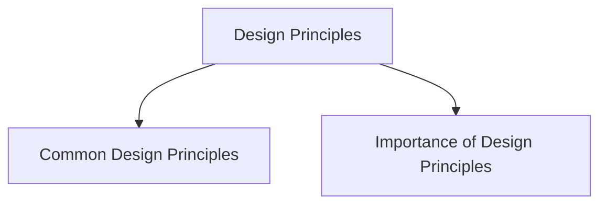

# Design Principles

Design principles are general guidelines used to create effective and usable interactive systems.

They help designers understand:

* What makes an interface easy to use
* How users interact with systems
* How to reduce user errors
* How to improve usability and user experience

Design principles are based on:

* Human behavior
* Experience
* Usability research
* Common design practices

## Common Design Principles

* Visibility
* Feedback
* Constraints
* Consistency
* Affordances

These principles help create interfaces that are:

* Simple
* Clear
* Learnable
* User-friendly

## Importance of Design Principles

Design principles help designers:

* Improve interaction quality
* Make systems easier to learn
* Reduce confusion
* Improve accessibility
* Create consistent interfaces

