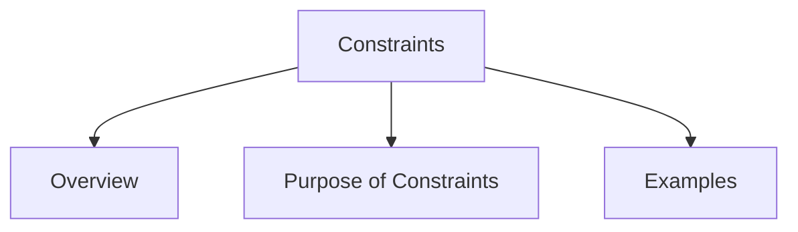

# Constraints

## Overview

Constraints restrict the actions users can perform in a system. They help prevent mistakes and guide users toward correct actions.

Constraints improve usability by reducing confusion and limiting incorrect operations.

## Purpose of Constraints

Constraints help users:

* Avoid errors
* Make correct choices
* Understand system limitations
* Use systems more safely and efficiently

## Examples

### Key and Lock

A key only fits into a lock in one correct way.

### USB Device

A USB cable can only be inserted in a specific orientation.

### Form Validation

Online forms prevent users from submitting incomplete or invalid information.

### Menu Restrictions

Disabled buttons or unavailable options stop users from selecting invalid actions.

