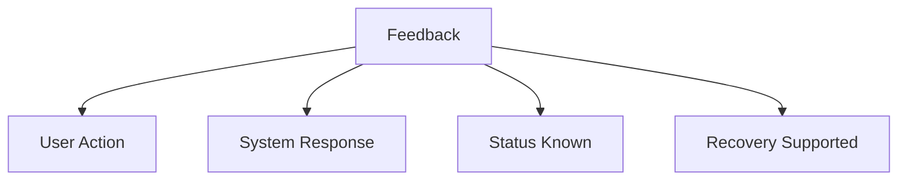

# Feedback

Feedback is the system’s response to a user’s action. It informs users about what has happened after an interaction.

Good feedback helps users understand:

* Whether an action was successful
* What the system is doing
* If an error occurred

Feedback improves usability and reduces confusion.

## Examples

### Button Click

A button changes color or highlights when clicked.

### Mobile Notifications

A phone vibrates or plays a sound after receiving a message.

### Loading Indicator

A progress bar or spinning icon shows that a task is processing.

