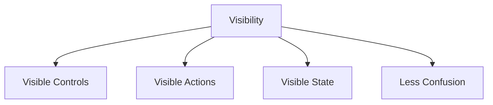

# Visibility

Visibility means important controls, actions, and system states should be easy for users to see and understand.

Users should quickly know:

* What actions are possible
* What to do next
* What the system is doing

Good visibility reduces confusion and improves usability.

## Examples

### Elevator Controls

Hidden card readers on elevators confuse users because the required action is not visible.

### Mobile Apps

Visible navigation buttons help users move easily between screens.

### ATM Machines

Clearly labeled buttons and screens make transactions easier and faster.

