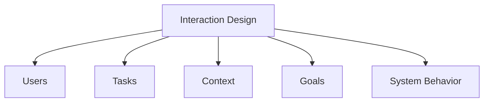

# Interaction Design

Interaction Design (IxD) focuses on designing interactive systems that support how people communicate, work, and interact in everyday life. It combines usability, accessibility, user experience, and interface design to create systems that are effective, efficient, and satisfying to use.

Interaction design is multidisciplinary and draws knowledge from:

* Computer Science
* Psychology
* Cognitive Science
* Ergonomics
* Sociology
* Graphic Design
* Engineering

The goal is to create systems that match user needs, behaviors, and expectations.

## What is Interaction Design?

Interaction design refers to:

> Designing interactive products to support the way people communicate and interact in their everyday and working lives.

It focuses on:

* Users
* Tasks
* Context of use
* User goals
* System behavior

Examples of interactive systems include:

* Websites
* Mobile applications
* ATM interfaces
* Smart TVs
* Wearable devices
* Virtual reality systems
