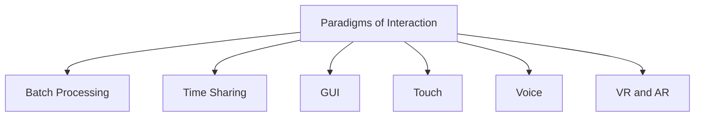

# Paradigms of Interaction

Paradigms of interaction are different ways humans communicate and interact with computers. They represent the evolution of interaction styles as technology advanced over time.

Interaction paradigms help improve:

* Usability
* Efficiency
* Accessibility
* User experience

As computing evolved, interaction moved from complex machine-centered systems to more natural and human-centered interfaces.

## Evolution of Paradigms

`Batch Processing → Time Sharing → GUI → Touch → Voice → VR/AR`
