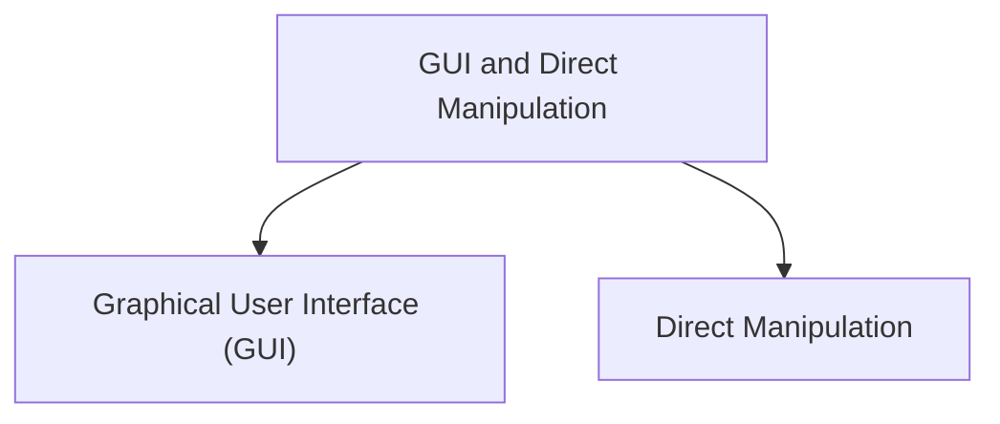

# GUI and Direct Manipulation

## Graphical User Interface (GUI)

A Graphical User Interface (GUI) allows users to interact with computers using visual elements instead of typing commands.

GUI systems commonly use:

* Windows
* Icons
* Menus
* Pointer devices

This interaction style is often called WIMP.

### Advantages

* Easy to learn
* Visual interaction
* User-friendly
* Reduces memorization

### Examples

* Windows OS
* macOS
* Android interfaces

## Direct Manipulation

Direct manipulation allows users to interact directly with objects shown on the screen.

Users can:

* Drag objects
* Move files
* Resize windows
* Select icons

The system provides immediate feedback after actions.

### Advantages

* Natural interaction
* Immediate response
* Easy to understand
* Improves usability

### Examples

* Drag and drop
* Touchscreen gestures
* File management systems
