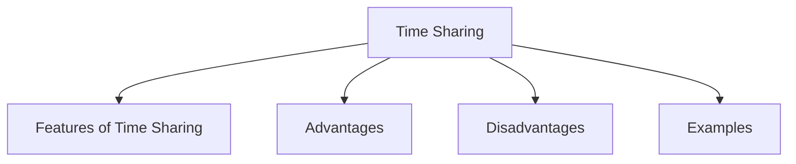

# Time Sharing

Time sharing is an interaction paradigm where multiple users can interact with a computer system at the same time.

The computer rapidly switches between users, giving each user a small amount of processing time.

This made computing more interactive compared to batch processing.

## Features of Time Sharing

* Multiple users share one system
* Interactive computing
* Faster feedback
* Users can directly interact with the computer

## Advantages

* Improved responsiveness
* Better resource sharing
* More efficient computer usage

## Disadvantages

* Expensive systems
* Performance slows with many users
* Requires complex operating systems

## Examples

* Multi-user mainframe systems
* University computer labs
* Shared server systems
