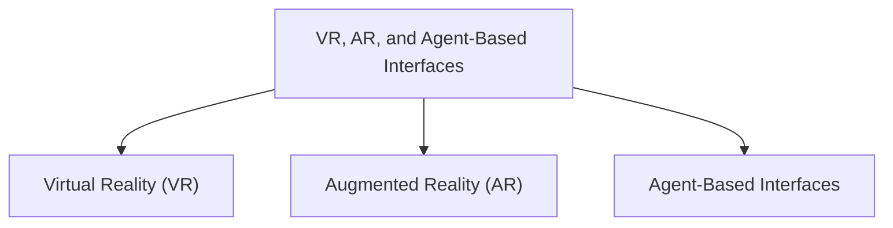

# VR, AR, and Agent-Based Interfaces

## Virtual Reality (VR)

Virtual Reality (VR) creates a fully digital and immersive environment where users interact inside a computer-generated world.

VR systems often use:

* VR headsets
* Motion tracking
* Sensors
* 3D interaction devices

### Features

* Immersive interaction
* 3D environments
* Real-time feedback
* Motion-based interaction

### Examples

* VR gaming
* Flight simulators
* Virtual training systems

## Augmented Reality (AR)

### Overview

Augmented Reality (AR) adds digital objects or information to the real world.

Unlike VR, users still see the physical environment while digital content is overlaid on top.

### Features

* Combines real and virtual objects
* Real-time interaction
* Interactive visual overlays

### Examples

* Snapchat filters
* Pokémon GO
* AR navigation systems

## Agent-Based Interfaces

### Overview

Agent-based interfaces use intelligent software agents to assist users and automate tasks.

These systems often use:

* Natural language processing
* AI assistance
* Proactive interaction

Agents communicate with users more naturally compared to traditional command systems.

### Examples

* Siri
* Alexa
* Google Assistant
* Chatbots

