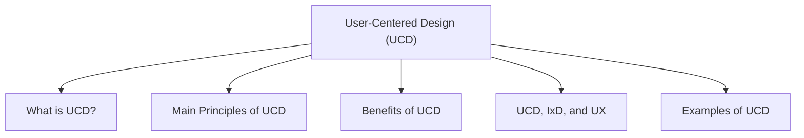

# User-Centered Design (UCD)

User-Centered Design (UCD) is a design approach where users are involved throughout the design process to ensure the system meets their real needs.

The focus is on:

* Users
* User needs
* Usability
* Accessibility
* User feedback

## What is UCD?

UCD focuses on designing systems around the user instead of the technology.

Designers study:

* How users behave
* What users need
* Problems users face
* User goals and tasks

## Main Principles of UCD

* Users are involved during development
* Design is improved through feedback
* Systems are tested with real users
* Design changes are made iteratively

## Benefits of UCD

UCD helps create systems that are:

* Easier to use
* More efficient
* More accessible
* More satisfying

It also reduces:

* User errors
* Confusion
* Frustration

## UCD, IxD, and UX

| Concept | Meaning        |
| ------- | -------------- |
| UCD     | How we design  |
| IxD     | What we design |
| UX      | How users feel |

## Examples of UCD

* Testing mobile apps with users
* Collecting user feedback
* Improving interfaces after usability testing
* Designing accessible websites
