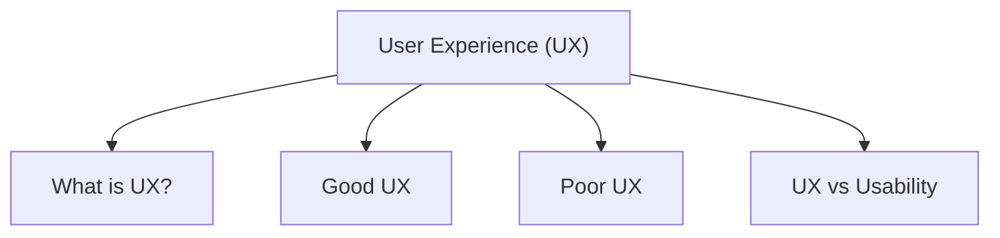

# User Experience (UX)

User Experience (UX) refers to how users feel when interacting with a product or system. It focuses on making systems enjoyable, easy to use, and satisfying.

Good UX improves:

* User satisfaction
* Ease of use
* Accessibility
* Engagement

## What is UX?

UX includes a user’s:

* Feelings
* Emotions
* Perceptions
* Satisfaction

It focuses on the complete experience users have while using a system.

## Good UX

A good user experience is:

* Enjoyable
* Simple
* Engaging
* Helpful
* Efficient

Examples:

* Smartphones
* Streaming apps
* Voice assistants
* Modern websites

## Poor UX

Poor UX may feel:

* Confusing
* Frustrating
* Slow
* Annoying

## UX vs Usability

| UX                            | Usability              |
| ----------------------------- | ---------------------- |
| Focuses on overall experience | Focuses on ease of use |
| Includes emotions             | Includes efficiency    |
| Broader concept               | Part of UX             |
