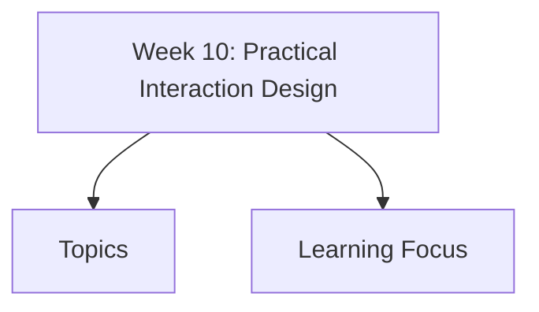

# Week 10: Practical Interaction Design

Week 10 focuses on practical interaction design basics: user focus, navigation, layout, controls, presentation, aesthetics, localisation, and iterative prototyping.

## Topics

- [Interaction Design Basics](interaction-design-basics/)
  - [Design Process](interaction-design-basics/design-process/)
  - [User Focus](interaction-design-basics/user-focus/)
  - [Personas](interaction-design-basics/personas/)
  - [Scenarios](interaction-design-basics/scenarios/)
- [Navigation Design](navigation-design/)
  - [Four Golden Rules](navigation-design/four-golden-rules/)
- [Screen Layout](screen-layout/)
  - [Grouping & Alignment](screen-layout/grouping-alignment/)
  - [White Space](screen-layout/white-space/)
  - [Information Presentation](screen-layout/information-presentation/)
  - [Aesthetics & Colour](screen-layout/aesthetics-colour/)
  - [Localisation](screen-layout/localisation/)
- [Physical Controls](physical-controls/)
  - [User Actions & Affordances](physical-controls/user-actions-affordances/)
- [Prototyping & Iteration](prototyping-iteration/)

## Learning Focus

By end of this week, you should be able to apply basic interaction design rules to navigation, layout, controls, information presentation, and iterative improvement.
