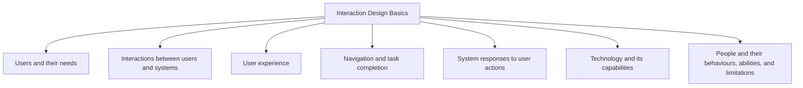

# Interaction Design Basics

Interaction Design (IxD) focuses on designing interactive systems that help users achieve their goals effectively and efficiently.

The aim is not only to design interfaces but also to design the interactions between people and technology. Good interaction design ensures that users can understand a system, navigate it easily, and complete tasks successfully.

Interaction design is concerned with:

- Users and their needs
- Interactions between users and systems
- User experience
- Navigation and task completion
- System responses to user actions

A key principle is that designers create interactions, not just interfaces. Design should consider the entire experience, including help systems, tutorials, and user support.

Design can be viewed as achieving goals within constraints. These constraints may include technology, time, resources, and user requirements.

The foundation of interaction design is understanding both:

- Technology and its capabilities
- People and their behaviours, abilities, and limitations

Since human error is normal, systems should be designed to prevent mistakes and support users when errors occur.

The user remains the central focus of all interaction design decisions.
