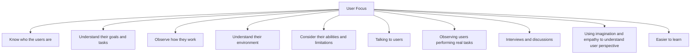

# User Focus

User focus is a fundamental principle of interaction design. Successful systems are designed around the people who will use them rather than around the technology itself.

Designers must understand their users because users often have different backgrounds, skills, experiences, goals, and limitations than the designers who create the system.

To achieve a user-focused design:

- Know who the users are
- Understand their goals and tasks
- Observe how they work
- Understand their environment
- Consider their abilities and limitations

A common mistake is assuming that users think and behave like the designer. In reality, users may have different levels of technical knowledge, experience, and expectations.

Methods used to understand users include:

- Talking to users
- Observing users performing real tasks
- Interviews and discussions
- Using imagination and empathy to understand user perspectives

User-focused design helps create systems that are:

- Easier to learn
- More efficient to use
- Less error-prone
- Better suited to user needs

The central message of interaction design is that the user should remain the primary focus throughout the entire design process.
