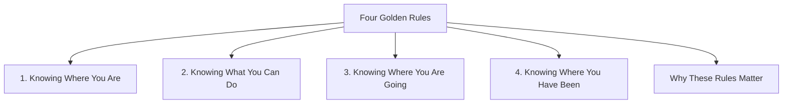

# Four Golden Rules

The Four Golden Rules of Interface Design help ensure that users can navigate a system confidently without feeling lost, confused, or frustrated.

They focus on helping users understand:

1. Where they are
2. What they can do
3. Where they are going
4. Where they have been

These rules form the foundation of good navigation design.



## 1. Knowing Where You Are

Users should always know their current location within the system.

Without clear location information, users can become disoriented, especially in large applications or websites.

Common techniques:

- Page titles
- Highlighted menu items
- Section headers
- Step indicators
- Breadcrumb navigation

### Breadcrumbs

Breadcrumbs show the path through a hierarchy and often provide links back to higher levels.

Example:

```text
Home > Courses > HCI > Navigation Design
```

Benefits:

- Shows current location
- Displays the path taken
- Allows quick movement to higher levels

## 2. Knowing What You Can Do

Users should be able to see the actions available at their current location.

If possible actions are unclear, users may hesitate or become frustrated.

Common techniques:

- Clear buttons
- Menus
- Tooltips
- Icons with labels
- Disabled controls for unavailable actions

### Example

In a Learning Management System (LMS), students may see options such as:

- View Lectures
- Submit Assignment
- Join Discussion Forum
- Check Grades

The available actions are immediately visible.

## 3. Knowing Where You Are Going

Users should be able to predict the result of their actions before performing them.

This reduces uncertainty, prevents mistakes, and increases trust in the system.

Common techniques:

- Confirmation dialogs
- Progress indicators
- Preview functions
- Informative button labels
- System feedback

### Example

```text
Delete File
```

The system displays:

```text
Are you sure you want to delete this file?
This action cannot be undone.
```

The user understands the consequence before proceeding.

## 4. Knowing Where You Have Been

Users should be able to review their previous actions and navigation history.

This helps maintain orientation and recover from mistakes.

Common techniques:

- Browser history
- Back button
- Undo/Redo
- Activity logs
- Recently viewed items
- Visited link indicators

### Example

In a web browser:

- The Back button returns to previous pages.
- Visited links change colour.

These features help users understand their navigation history.

## Why These Rules Matter

The Four Golden Rules help to:

- Prevent confusion
- Build a mental model of the system
- Reduce hesitation and frustration
- Increase confidence
- Improve predictability
- Support error recovery

Good navigation ensures that users always understand:

- Their current position
- Available actions
- Expected outcomes
- Previous actions and locations
