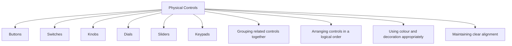

# Physical Controls

Physical controls are the hardware components that users interact with directly to operate a device. Unlike graphical interface elements on a screen, physical controls exist in the real world and can be touched, pressed, turned, or moved.

Examples of physical controls include:

- Buttons
- Switches
- Knobs
- Dials
- Sliders
- Keypads

The design of physical controls affects how easily users can understand and operate a device. Users should be able to identify available controls, understand their purpose, and use them with minimal effort.

Design principles used for screen interfaces also apply to physical controls, including:

- Grouping related controls together
- Arranging controls in a logical order
- Using colour and decoration appropriately
- Maintaining clear alignment
- Using spacing to improve organization

Good physical control design helps users perform tasks efficiently, reduces errors, and makes devices easier to learn and use.
