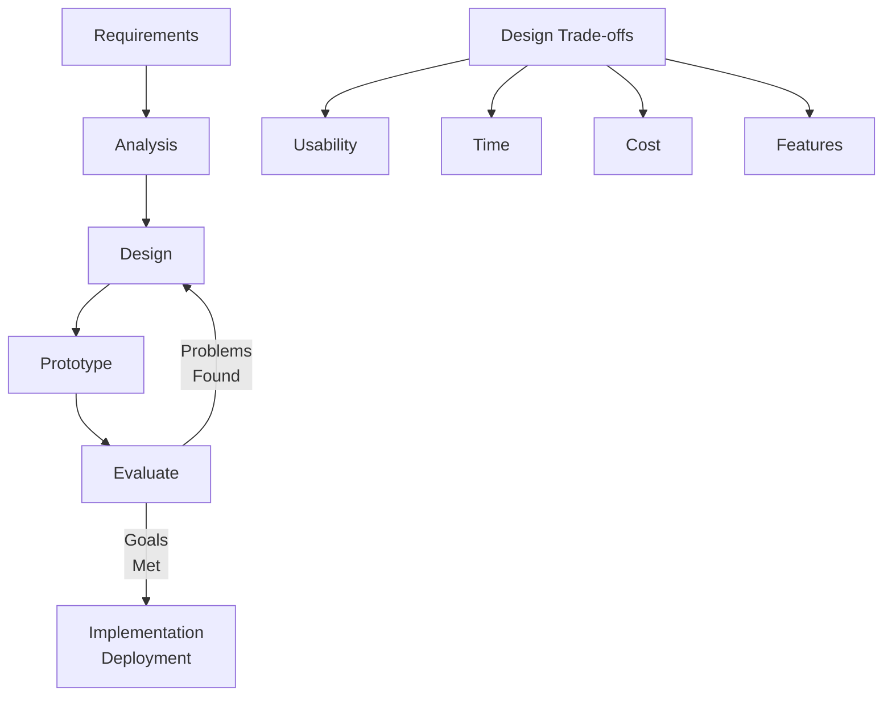

# Prototyping & Iteration

Prototyping is the creation of an early version of a system used to explore ideas, test designs, and gather feedback before full development.

A prototype may be:

- Paper sketches
- Wireframes
- Mockups
- Partially working systems

The purpose of prototyping is to:

- Test design concepts
- Identify usability problems
- Collect user feedback
- Reduce development risks
- Explore alternative solutions

A fundamental principle of interaction design is:

> You never get it right the first time.

Because of this, design is an iterative process.

## Iteration

Iteration is the repeated cycle of improving a design based on evaluation and feedback.

The typical cycle is:

Each iteration helps designers:

- Improve usability
- Discover new requirements
- Fix design problems
- Refine ideas

Evaluation is performed after creating a prototype to determine what works well and what needs improvement.

## Benefits

- Problems are found early
- Changes are cheaper to make
- User feedback can guide development
- The final design better meets user needs

## Pitfalls of Prototyping

Prototyping alone does not guarantee a good design.

Potential problems include:

- Making small improvements without a clear direction
- Starting with a poor initial design
- Failing to understand the real cause of usability issues

To be effective, designers must understand both the design goals and the problems identified during evaluation.

Prototyping and iteration work together to gradually improve a system until it satisfies user needs and design objectives.
