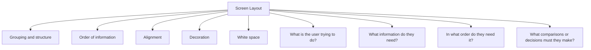

# Screen Layout

Screen layout focuses on how information, controls, and interface elements are arranged on a screen. A good layout helps users quickly understand information, locate functions, and complete tasks efficiently.

The goal of screen layout is to present information in a clear, organized, and meaningful way. Poor layouts can confuse users, increase cognitive load, and make systems harder to use.

Effective screen design follows the principle:

> Form follows function.

This means that the arrangement of interface elements should support what the user is trying to accomplish.

Screen layout is built around several key design principles:

- Grouping and structure
- Order of information
- Alignment
- Decoration
- White space

When designing a screen, designers should first ask:

- What is the user trying to do?
- What information do they need?
- In what order do they need it?
- What comparisons or decisions must they make?

A well-designed layout improves readability, navigation, efficiency, and overall usability by making information easy to find and understand.
