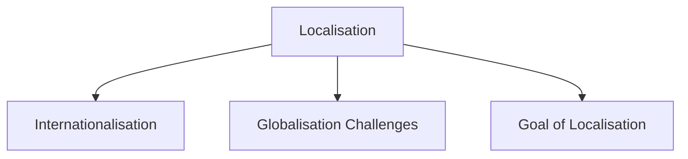

# Localisation

Localisation is the process of adapting an interface for a specific language, culture, or region so that it feels natural and understandable to local users.

It involves more than simply translating text. Different cultures may have different expectations, symbols, reading directions, formats, and values.

Localisation may require changes to:

- Language
- Text size and layout
- Date and time formats
- Currency formats
- Colours and symbols
- Reading direction

For example, changing a system from English to another language may affect:

- Screen layouts
- Button sizes
- Navigation order
- Text alignment

## Internationalisation

Internationalisation is the process of designing a system so that it can be easily adapted for different languages and cultures.

A common approach is to store interface text in resource files instead of hard-coding it into the system.

This allows different language versions to be created without changing the application's core functionality.

## Globalisation Challenges

Some design elements do not have the same meaning across cultures.

Examples include:

- Symbols
- Colours
- Icons
- Gestures

A symbol that is positive in one culture may have a different meaning in another.

Because of these differences, designers should avoid making assumptions based on their own cultural background.

## Goal of Localisation

The goal of localisation is to ensure that users from different countries and cultures can understand and use a system effectively while feeling that the interface was designed for them.
