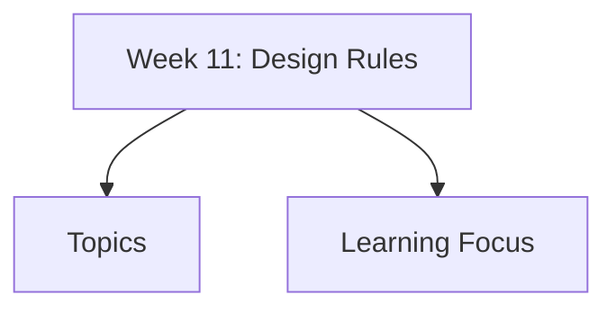

# Week 11: Design Rules

Week 11 covers design rules: principles, standards, guidelines, usability rules, HCI patterns, accessibility, error recovery, consistency, feedback, and user-centered usability design.

## Topics

- [Design Rules](design-rules/)
  - [Principles, Standards, and Guidelines](design-rules/principles-standards-guidelines/)
  - [Learnability, Flexibility, and Robustness](design-rules/learnability-flexibility-robustness/)
- [Usability Principles](usability-principles/)
  - [Shneiderman's 8 Golden Rules](usability-principles/shneidermans-8-golden-rules/)
  - [Norman's 7 Principles](usability-principles/normans-7-principles/)
  - [Error Prevention and Recovery](usability-principles/error-prevention-recovery/)
  - [Interface Consistency and Feedback](usability-principles/interface-consistency-feedback/)
- [Design Patterns in HCI](design-patterns-hci/)
  - [HCI Pattern Language](design-patterns-hci/hci-pattern-language/)
- [Standards and Accessibility](standards-accessibility/)
- [User-Centered Usability Design](user-centered-usability-design/)

## Learning Focus

Use rules as design support, not blind checklist. Apply principles, standards, and patterns to reduce errors, improve consistency, and support accessible user-centered systems.
