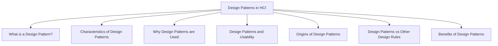

# Design Patterns in HCI

Design patterns are reusable solutions to common design problems that occur repeatedly in a particular context.

Instead of solving the same design problem from scratch every time, designers can reuse proven solutions that have worked successfully before.

A design pattern is not a complete design. It is a general solution that can be adapted to different situations.

## What is a Design Pattern?

A design pattern consists of three main elements:

| Element | Description |
|----------|-------------|
| Problem | A recurring design problem |
| Context | The situation in which the problem occurs |
| Solution | A proven way to solve the problem |

A pattern becomes valuable because the same problem appears repeatedly across many systems.

## Characteristics of Design Patterns

Design patterns are:

- Reusable
- Based on real design experience
- Tested in practice
- Applicable to recurring problems
- Adaptable to different systems

They help designers avoid reinventing solutions that already work well.

## Why Design Patterns are Used

Design patterns help designers:

- Reuse successful design knowledge
- Increase consistency across interfaces
- Reduce design effort
- Improve usability
- Solve common problems more efficiently

Because patterns are based on proven solutions, they often lead to more reliable interface designs.

## Design Patterns and Usability

Design patterns support usability by providing solutions that users are already familiar with.

When users encounter familiar interface structures, they can understand and use the system more easily.

Examples include:

- Consistent navigation structures
- Standard search interfaces
- Common dialog layouts
- Familiar menu organization

These solutions have been refined through repeated use and experience.

## Origins of Design Patterns

The concept of design patterns originated in architecture, where architects reused successful building solutions in similar situations.

The same idea was later applied to Human-Computer Interaction and interface design.

The basic idea remains the same:

> A recurring problem in a specific context can often be solved using a recurring solution.

## Design Patterns vs Other Design Rules

| Design Rule | Purpose |
|-------------|---------|
| Principles | General usability concepts |
| Guidelines | Recommended design practices |
| Standards | Mandatory design requirements |
| Design Patterns | Reusable solutions to common design problems |

While principles explain what good design is, design patterns provide examples of how good design can be achieved in practice.

## Benefits of Design Patterns

- Encourage reuse of successful designs
- Improve consistency
- Support usability
- Reduce development time
- Provide proven solutions
- Help communicate design ideas among team members

Design patterns allow designers to build upon existing knowledge rather than repeatedly solving the same problems from the beginning.
