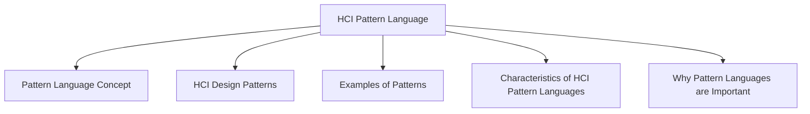

# HCI Pattern Language

A pattern language is a collection of related design patterns that work together to help designers create complete interactive systems.

Individual patterns do not exist in isolation. Instead, they are connected to other patterns and can be combined to solve larger design problems.

A pattern language provides a structured way to reuse design knowledge across an entire system.

## Pattern Language Concept

A pattern language links multiple patterns together so that designers can move from high-level design decisions to detailed interface solutions.

Instead of solving one isolated problem, a pattern language helps generate a complete design.

### Example

A navigation pattern may connect to:

- Menu patterns
- Search patterns
- Breadcrumb patterns
- Page layout patterns

Together these patterns form a coherent interface design.

## HCI Design Patterns

HCI design patterns are an approach to reusing knowledge about successful interface solutions.

They originated from the work of architect :contentReference[oaicite:0]{index=0}, who proposed that recurring problems in specific contexts can be solved using recurring solutions.

A pattern is:

> An invariant solution to a recurrent problem within a specific context.

This means the core idea remains the same even though the implementation may vary.

## Examples of Patterns

| Domain | Pattern Example |
|----------|----------------|
| Architecture | Light on Two Sides of Every Room |
| HCI | Go Back to a Safe Place |

These patterns solve common problems that repeatedly occur in their respective domains.

## Characteristics of HCI Pattern Languages

### Capture Design Practice, Not Theory

Patterns come from practical experience and successful designs rather than abstract theories.

They represent solutions that have already been tested in real systems.

### Capture Common Properties of Good Designs

Patterns identify the important characteristics shared by successful interface designs.

This allows designers to reuse proven ideas.

### Represent Knowledge at Multiple Levels

Patterns can describe solutions at different levels:

| Level | Focus |
|---------|-------|
| Social | Human interactions and collaboration |
| Organizational | Workflows and processes |
| Conceptual | Overall system structure |
| Detailed | Specific interface elements |

### Embody Human Values

Patterns can express what is humane and user-centered in interface design.

They focus not only on efficiency but also on supporting user needs and experiences.

### Support Communication

Patterns are intuitive and easy to understand.

They provide a common language for:

- Designers
- Developers
- Clients
- Stakeholders

Everyone can discuss designs using the same concepts and terminology.

### Generative Nature

A pattern language should be generative.

This means it should help designers create complete designs rather than isolated interface components.

By combining related patterns, designers can systematically build an entire interactive system.

## Why Pattern Languages are Important

Pattern languages help:

- Reuse successful design knowledge
- Improve consistency across systems
- Support communication among stakeholders
- Connect high-level and low-level design decisions
- Generate complete interface designs
- Promote user-centered solutions
