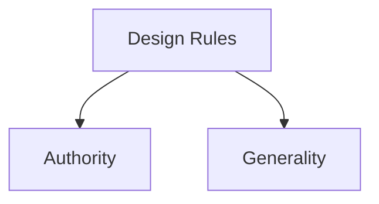

# Design Rules

Design rules are recommendations and principles that help designers create interactive systems with maximum usability. They provide guidance for making systems easier to learn, easier to use, and more effective for users.

The goal of interaction design is to maximize usability, and design rules provide a structured way to achieve this goal.
Design rules differ in two important characteristics:

| Characteristic | Meaning |
|---------------|---------|
| Authority | How strongly a rule must be followed |
| Generality | How broadly a rule can be applied across systems |

## Authority

Authority describes the strength of a rule and the consequences of ignoring it.

- High authority rules must be followed.
- Medium authority rules are strongly recommended.
- Low authority rules provide general advice.

Examples:

| Rule | Authority |
|--------|-----------|
| Traffic red light | High |
| Speed limit recommendation | Medium |
| Drive safely | Low |

## Generality

Generality describes how widely a rule can be applied.

- High generality means the rule applies to many systems and situations.
- Low generality means the rule applies only in specific contexts.

A rule that can be applied almost everywhere has high generality, while a rule designed for a particular technology or interface has lower generality.

## Related Notes

- [Principles, Standards, and Guidelines](principles-standards-guidelines/)
- [Learnability, Flexibility, and Robustness](learnability-flexibility-robustness/)
- [Usability Principles](../usability-principles/)
