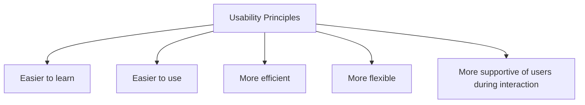

# Usability Principles

Usability principles are general design principles that guide designers in creating systems that are effective, efficient, and satisfying to use.

They provide a framework for evaluating and improving usability rather than prescribing specific interface solutions.

The three primary usability principles are:

| Principle | Focus |
|------------|--------|
| Learnability | How easily users can learn and understand the system |
| Flexibility | The variety of ways users and systems can exchange information |
| Robustness | The support provided to help users achieve and assess goals |

These principles help designers identify strengths and weaknesses in an interface and serve as the foundation for many design rules, guidelines, heuristics, and evaluation methods used in Human-Computer Interaction.

The goal of usability principles is to increase usability by making systems:

- Easier to learn
- Easier to use
- More efficient
- More flexible
- More supportive of users during interaction

Learnability, flexibility, and robustness together form the core framework for designing usable interactive systems.
