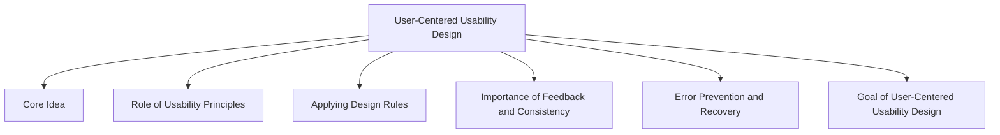

# User-Centered Usability Design

User-Centered Usability Design is an approach to design that focuses on the needs, goals, abilities, and limitations of users throughout the design process.

The primary objective is to create systems that are effective, efficient, easy to learn, and satisfying to use.

Rather than designing based on technology alone, designers focus on how real users interact with the system and whether the design supports their tasks successfully.

## Core Idea

The success of an interactive system depends on how well it supports users in achieving their goals.

Design decisions should therefore be based on:

- User needs
- User tasks
- User capabilities
- User expectations
- Context of use

## Role of Usability Principles

User-centered usability design relies on usability principles to guide design decisions.

The three main principles are:

| Principle | Focus |
|------------|--------|
| Learnability | Helping users learn the system easily |
| Flexibility | Supporting multiple ways of interaction |
| Robustness | Supporting users in completing tasks and recovering from problems |

These principles help designers evaluate whether a system truly supports its users.

## Applying Design Rules

User-centered design makes use of different design rules:

| Design Rule | Contribution |
|-------------|-------------|
| Principles | Provide general usability concepts |
| Guidelines | Recommend good design practices |
| Standards | Ensure compliance and consistency |
| Design Patterns | Reuse proven design solutions |

These rules help designers create interfaces that are easier to learn, more predictable, and more effective.

## Importance of Feedback and Consistency

Two important usability goals in user-centered design are:

### Consistency

Users should encounter similar behavior throughout the system.

Examples:

- Consistent menus
- Consistent terminology
- Consistent layouts
- Consistent commands

### Feedback

Users should always know what the system is doing.

Examples:

- Progress indicators
- Success messages
- Error messages
- Status notifications

Together, consistency and feedback improve usability and reduce user confusion.

## Error Prevention and Recovery

User-centered systems should assume that users will make mistakes.

Good design therefore:

- Prevents errors whenever possible
- Provides clear error messages
- Supports recovery from mistakes
- Allows actions to be reversed

Examples:

- Input validation
- Disabled invalid options
- Undo functionality
- Confirmation dialogs

## Goal of User-Centered Usability Design

The overall goal is to maximize usability by creating systems that are:

- Effective
- Efficient
- Learnable
- Flexible
- Robust
- Safe
- User friendly

Successful usability design combines creative design ideas with established principles, guidelines, standards, and patterns to support real users and their real tasks.
