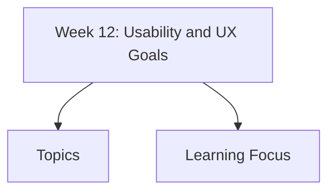

# Week 12: Usability and UX Goals

Week 12 covers user control, error prevention, usability and UX goals, evaluation types, measurement, and Theo Mandel's golden rules.

## Topics

- [User Control and Error Prevention](user-control-error-prevention/)
- [Usability Goals](usability-goals/)
- [UX Goals](ux-goals/)
- [Evaluation Types](evaluation-types/)
  - [Quantitative vs Qualitative Evaluation](evaluation-types/quantitative-vs-qualitative-evaluation/)
  - [Measuring Usability and UX](evaluation-types/measuring-usability-ux/)
- [Theo Mandel's Golden Rules](theo-mandels-golden-rules/)

## Learning Focus

Define measurable usability/UX goals, compare evaluation evidence types, and design interfaces that keep users in control while preventing and recovering from errors.
