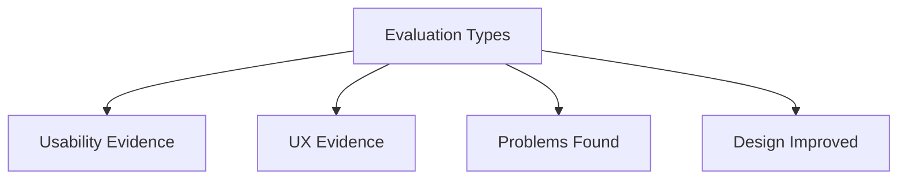

# Evaluation Types

Evaluation is the process of assessing an interactive system to determine whether it meets user needs, usability goals, and user experience goals. It helps designers understand how well a system works, identify usability problems, and determine areas for improvement.

Evaluation is an important activity throughout the design process and can be performed on early prototypes, partially completed systems, or finished products. The goal is to gather evidence about how users interact with a system and whether the design successfully supports their tasks and expectations.

Evaluation focuses on questions such as:

* Can users complete their tasks successfully?
* Is the system easy to learn and use?
* Does the system provide a positive user experience?
* What usability problems exist?
* How can the design be improved?

Different evaluation approaches can be used depending on the purpose of the study, the stage of development, and the type of information required. Some methods focus on measurable performance data, while others focus on understanding user opinions, perceptions, and experiences.

Evaluation therefore provides the foundation for improving both usability and user experience, ensuring that interactive systems are effective, efficient, satisfying, and enjoyable to use.

