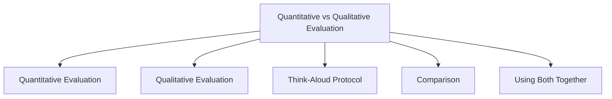

# Quantitative vs Qualitative Evaluation

Evaluation methods can be divided into two main categories:

* **Quantitative Evaluation** – focuses on numerical and measurable data.
* **Qualitative Evaluation** – focuses on understanding user opinions, experiences, and behaviors.

Both approaches are often used together to obtain a complete picture of usability and user experience. Quantitative methods tell us **what happened**, while qualitative methods help explain **why it happened**.

## Quantitative Evaluation

Quantitative evaluation uses numerical measurements to assess system performance and usability.

### Characteristics

* Objective and measurable
* Produces numerical results
* Easy to compare across users and systems
* Useful for identifying trends and performance levels

### Common Metrics

| Metric               | What It Measures                                   |
| -------------------- | -------------------------------------------------- |
| Task Completion Rate | Percentage of users who successfully finish a task |
| Task Completion Time | Time required to complete a task                   |
| Error Rate           | Number of mistakes made by users                   |
| Click Count          | Number of actions required                         |
| Success Rate         | Percentage of successful interactions              |
| SUS Score            | Overall usability score                            |

### Example

100 users attempt to order food:

* 90 users successfully place an order
* Average ordering time = 1.5 minutes
* Error rate = 1.2%

Results:

* Effectiveness = 90% success rate
* Efficiency = 1.5 minutes per task
* Safety = 1.2% error rate

These values can be directly measured and compared.

### Advantages

* Objective results
* Easy statistical analysis
* Good for benchmarking
* Suitable for large user groups

### Limitations

* Does not explain user feelings
* May miss reasons behind problems
* Focuses mainly on performance

## Qualitative Evaluation

Qualitative evaluation focuses on understanding user experiences, opinions, thoughts, and emotions.

### Characteristics

* Subjective and descriptive
* Explores user perceptions
* Helps discover usability problems
* Provides detailed feedback

### Common Methods

| Method               | Purpose                            |
| -------------------- | ---------------------------------- |
| Interviews           | Understand user opinions           |
| Observation          | Study user behavior                |
| Questionnaires       | Collect feedback                   |
| Think-Aloud Protocol | Understand user thought processes  |
| User Feedback        | Gather perceptions and suggestions |

### Example

While ordering food, users say:

> "I can't find the checkout button."

> "I thought this icon opened the cart."

> "The payment page is confusing."

These comments reveal usability issues that numerical data alone cannot explain.

### Advantages

* Explains why problems occur
* Reveals user expectations
* Identifies confusion and frustration
* Provides deeper insights

### Limitations

* Harder to analyze
* More time-consuming
* Results can be subjective
* Smaller sample sizes are common

## Think-Aloud Protocol

A common qualitative technique where users verbalize their thoughts while performing tasks.

Example:

User says:

* "Where is the checkout button?"
* "I expected this icon to open my cart."
* "I'm not sure what this option means."

This helps identify:

* Confusion points
* Incorrect assumptions
* Mental models
* Usability problems

## Comparison

| Aspect      | Quantitative Evaluation    | Qualitative Evaluation                |
| ----------- | -------------------------- | ------------------------------------- |
| Data Type   | Numerical                  | Descriptive                           |
| Focus       | Performance                | Experience                            |
| Nature      | Objective                  | Subjective                            |
| Sample Size | Usually larger             | Usually smaller                       |
| Answers     | What happened?             | Why did it happen?                    |
| Examples    | Success rate, time, errors | Interviews, observations, think-aloud |

## Using Both Together

The most effective evaluations combine both approaches.

Example:

A food delivery app evaluation finds:

### Quantitative Results

* Task completion rate = 92%
* Average ordering time = 2 minutes

### Qualitative Results

Users report:

* Checkout button is difficult to find.
* Payment process feels confusing.

The quantitative data shows **how well users performed**, while the qualitative data explains **why some users struggled**. Together they provide a complete evaluation of usability and user experience.

