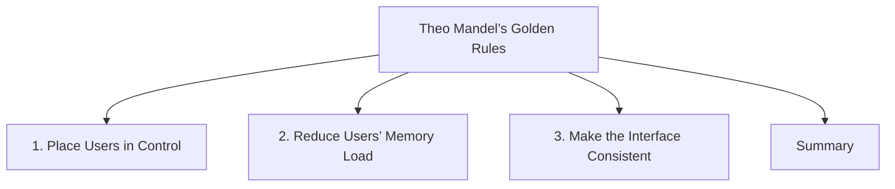

# Theo Mandel’s Golden Rules

Theo Mandel proposed a set of interface design rules that focus on creating systems that are easy to learn, easy to use, and consistent. His rules are organized into three major categories:

1. Place Users in Control
2. Reduce Users’ Memory Load
3. Make the Interface Consistent

These principles emphasize user freedom, minimizing cognitive effort, and maintaining predictable interactions across the interface.

## 1. Place Users in Control

Users should feel that they are directing the interaction rather than being controlled by the system.

The main rules are:

| Rule                                   | Purpose                                    |
| -------------------------------------- | ------------------------------------------ |
| Use modes judiciously                  | Avoid unnecessary modes that confuse users |
| Support keyboard and mouse interaction | Provide flexibility                        |
| Allow users to change focus            | Make interaction interruptible             |
| Display descriptive messages           | Help users understand what is happening    |
| Provide immediate feedback             | Keep users informed                        |
| Provide meaningful exits               | Allow easy navigation and escape           |
| Accommodate different skill levels     | Support beginners and experts              |
| Make the interface transparent         | Keep system behavior understandable        |
| Allow customization                    | Let users adapt the interface              |
| Support direct manipulation            | Enable interaction with visible objects    |

Examples:

* Keyboard shortcuts for expert users.
* Cancel buttons during lengthy operations.
* Drag-and-drop interaction.
* User-configurable toolbars.

## 2. Reduce Users’ Memory Load

Human short-term memory is limited. Interfaces should minimize the amount of information users must remember.

The main rules are:

| Rule                                   | Purpose                                  |
| -------------------------------------- | ---------------------------------------- |
| Relieve short-term memory              | Reduce information users must remember   |
| Rely on recognition rather than recall | Show options instead of requiring memory |
| Provide visual cues                    | Guide users through the interface        |
| Provide defaults, undo, and redo       | Reduce mental effort                     |
| Provide shortcuts                      | Improve efficiency for frequent users    |
| Promote object-action syntax           | Make actions intuitive                   |
| Use real-world metaphors               | Leverage existing knowledge              |
| Use progressive disclosure             | Show information when needed             |
| Promote visual clarity                 | Organize information effectively         |

Examples:

* Menus instead of memorized commands.
* Recently opened file lists.
* Default form values.
* Icons accompanied by labels.

## 3. Make the Interface Consistent

Consistency helps users predict system behavior and transfer knowledge from one part of the system to another.

The main rules are:

| Rule                                 | Purpose                                |
| ------------------------------------ | -------------------------------------- |
| Sustain task context                 | Maintain continuity during interaction |
| Maintain consistency across products | Use familiar patterns                  |
| Keep interaction results predictable | Produce expected outcomes              |
| Provide aesthetic integrity          | Maintain a coherent appearance         |
| Encourage exploration                | Make actions predictable and safe      |

Examples:

* Same navigation structure throughout a website.
* Consistent button styles and colors.
* Similar commands performing the same actions everywhere.
* Uniform terminology across screens.

## Summary

| Category                      | Main Goal                                        |
| ----------------------------- | ------------------------------------------------ |
| Place Users in Control        | Give users freedom, flexibility, and control     |
| Reduce Users’ Memory Load     | Minimize cognitive effort and reliance on memory |
| Make the Interface Consistent | Create predictable and familiar interactions     |

Theo Mandel's Golden Rules focus on creating interfaces that are **controllable, memorable, and consistent**, making systems easier to learn and use effectively.

