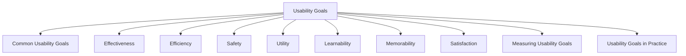

# Usability Goals

Usability goals describe how easy, effective, and efficient an interactive system is for users. They focus on helping users successfully complete tasks while minimizing effort, errors, and frustration. When designing a system, it is important to clearly define what users should be able to accomplish and how well they should be able to accomplish it.

Usability is concerned with task performance and can often be measured objectively through observation, testing, and quantitative metrics.

## Common Usability Goals

| Goal          | Description                                                                         |
| ------------- | ----------------------------------------------------------------------------------- |
| Effectiveness | The extent to which users can complete tasks accurately and successfully.           |
| Efficiency    | How quickly and with how little effort users can complete tasks.                    |
| Safety        | The ability of the system to prevent errors and protect users from mistakes.        |
| Utility       | Whether the system provides the functions users need.                               |
| Learnability  | How easy it is for new users to learn the system.                                   |
| Memorability  | How easily users can remember how to use the system after a period of not using it. |
| Satisfaction  | Whether users feel pleased and comfortable when using the system.                   |

## Effectiveness

Effectiveness measures whether users can achieve their goals correctly and completely.

Questions:

* Can users complete the intended task?
* Can they achieve accurate results?
* Are tasks completed successfully?

Example:

A food delivery application allows users to successfully place and receive orders without confusion.

## Efficiency

Efficiency measures the resources, time, and effort required to complete a task.

Questions:

* How quickly can users perform a task?
* How much effort is required?
* Can common tasks be completed with minimal steps?

Example:

A coffee machine that produces coffee with a single button press demonstrates efficient interaction.

## Safety

Safety refers to protecting users from making serious mistakes and reducing the consequences of errors.

Questions:

* Does the system prevent mistakes?
* Can users recover from errors?
* Are dangerous actions protected?

Example:

A child-proof medicine container reduces the risk of accidental misuse. Hospital software often requires stronger safety mechanisms than entertainment applications because mistakes can have serious consequences.

## Utility

Utility refers to whether the system provides the functions and features users actually need.

Questions:

* Does the system solve the intended problem?
* Are the necessary functions available?
* Can users accomplish their goals?

Example:

A Swiss Army knife provides multiple useful functions for different situations.

## Learnability

Learnability measures how easy it is for new users to understand and begin using a system.

Questions:

* Can beginners learn quickly?
* Is training required?
* Are tasks easy to discover?

Example:

A microwave with clearly labeled buttons and simple controls is easy for first-time users to learn.

## Memorability

Memorability measures how easily users can remember how to use a system after a period of not using it.

Questions:

* Can users return after weeks or months and still operate the system?
* Are commands and workflows easy to remember?

Example:

An application with intuitive navigation and consistent design is easier to remember.

## Satisfaction

Satisfaction refers to how pleased and comfortable users feel after using a system.

Questions:

* Do users enjoy using the system?
* Does the interaction feel pleasant?
* Would users choose to use it again?

Example:

An online shopping platform with a smooth and enjoyable experience can increase user satisfaction.

## Measuring Usability Goals

Usability goals can be evaluated using quantitative measurements.

| Goal          | Example Measurement                    |
| ------------- | -------------------------------------- |
| Effectiveness | Task completion rate                   |
| Efficiency    | Time taken to complete tasks           |
| Safety        | Error rate                             |
| Utility       | Feature usage rate                     |
| Learnability  | Time required to learn the system      |
| Memorability  | Time required to relearn after a break |
| Satisfaction  | User ratings or usability scores       |

Examples:

* 92% task completion rate indicates high effectiveness.
* Average task completion time of 3 minutes indicates efficiency.
* 1 error per 50 uses indicates good safety.
* SUS score of 87/100 indicates strong satisfaction.

## Usability Goals in Practice

Example: Food Delivery Application

| Goal          | Example                                            |
| ------------- | -------------------------------------------------- |
| Effectiveness | Users successfully place orders.                   |
| Efficiency    | Orders are placed within a few minutes.            |
| Safety        | Payment and ordering errors are minimized.         |
| Learnability  | New users can place orders on their first attempt. |
| Satisfaction  | Users feel pleased with the overall experience.    |

Usability goals focus on answering a single question:

**Can users perform their tasks effectively, efficiently, safely, and satisfactorily using the system?**

