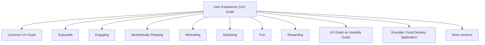

# User Experience (UX) Goals

User Experience (UX) goals focus on how users feel when interacting with a system. While usability goals concentrate on task completion and performance, UX goals are concerned with emotions, perceptions, enjoyment, and overall satisfaction. UX aims to create positive and meaningful experiences rather than simply enabling users to complete tasks.

When designing an interactive system, it is important to consider not only what users can do, but also how they feel while doing it.

## Common UX Goals

| Goal                   | Description                                                    |
| ---------------------- | -------------------------------------------------------------- |
| Enjoyable              | Users like using the system.                                   |
| Engaging               | The system keeps users interested and involved.                |
| Aesthetically Pleasing | The interface looks attractive and polished.                   |
| Motivating             | Encourages users to continue using the system.                 |
| Satisfying             | Users feel good after completing tasks.                        |
| Fun                    | Provides entertainment and enjoyment.                          |
| Rewarding              | Users feel they gained something valuable from the experience. |

## Enjoyable

An enjoyable system creates positive feelings during interaction.

Characteristics:

* Pleasant to use
* Comfortable interaction
* Creates positive emotions

Example:

A music streaming application that users enjoy exploring and using regularly.

## Engaging

Engagement refers to keeping users interested and actively involved.

Characteristics:

* Maintains attention
* Encourages interaction
* Promotes continued use

Example:

Educational applications that encourage students to keep learning through interactive content.

## Aesthetically Pleasing

Users often judge systems based on visual appearance.

Characteristics:

* Attractive design
* Professional appearance
* Clear visual hierarchy

Example:

A modern mobile application with clean layouts, good typography, and consistent visual design.

## Motivating

Motivating systems encourage users to continue working toward their goals.

Characteristics:

* Encourages progress
* Supports continued participation
* Reinforces achievement

Example:

Fitness applications that encourage users to maintain exercise streaks.

## Satisfying

Satisfaction refers to the positive feeling users experience after completing tasks.

Characteristics:

* Sense of accomplishment
* Smooth interaction
* Positive overall impression

Example:

Successfully completing an online purchase without problems.

## Fun

Some systems are specifically designed to be entertaining.

Characteristics:

* Enjoyment during interaction
* Playfulness
* Entertainment value

Examples:

* Video games
* Children's educational software
* Interactive learning applications

## Rewarding

Users should feel that they gained something meaningful from the interaction.

Characteristics:

* Sense of achievement
* Valuable outcomes
* Positive reinforcement

Example:

A learning platform that helps users gain new skills and track their progress.

## UX Goals vs Usability Goals

| Aspect        | Usability Goals          | UX Goals                          |
| ------------- | ------------------------ | --------------------------------- |
| Focus         | Task performance         | User feelings                     |
| Nature        | Objective and measurable | Subjective and perception-based   |
| Main Question | Can the user do it?      | How does the user feel?           |
| Example       | Time to complete a task  | Enjoyment while completing a task |

## Example: Food Delivery Application

### Usability Perspective

* Can users find restaurants easily?
* Can they place orders quickly?
* Are payment errors minimized?
* Is the interface easy to learn?

### UX Perspective

* Is the application visually appealing?
* Is browsing enjoyable?
* Does the application feel trustworthy?
* Is the ordering experience satisfying?

A system can be highly usable but still provide a poor user experience. For example, an application may allow users to order food quickly but have a boring or unattractive interface. Likewise, a visually attractive application may provide a pleasant experience but still be inefficient to use.

## Measuring UX Goals

UX goals are generally measured using qualitative methods because they involve user perceptions and emotions.

Common methods:

* User interviews
* Questionnaires
* Likert-scale surveys
* Observation
* Think-aloud protocol

Example:

"The app is easy to use."

* 1 = Strongly Disagree
* 5 = Strongly Agree

An average score of 4.3 would indicate a positive user experience.

UX goals focus on answering the question:

**How do users feel before, during, and after interacting with a system?**

