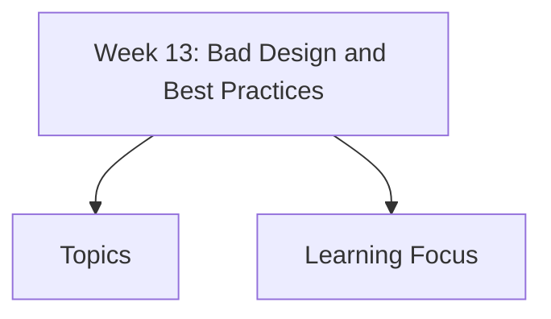

# Week 13: Bad Design and Best Practices

Week 13 studies bad website and UI design examples, common UX failures, dark patterns, and best practices for usable, ethical, and effective interfaces.

## Topics

- [Bad Website Design Examples](bad-website-design-examples/)
- [Common UI Design Mistakes](common-ui-design-mistakes/)
  - [Poor Navigation & Information Architecture](common-ui-design-mistakes/poor-navigation-information-architecture/)
  - [Visual Clutter and Overloaded Interfaces](common-ui-design-mistakes/visual-clutter-overloaded-interfaces/)
  - [Readability and Typography Problems](common-ui-design-mistakes/readability-typography-problems/)
  - [Lack of Visual Hierarchy](common-ui-design-mistakes/lack-visual-hierarchy/)
  - [Mobile Responsiveness Issues](common-ui-design-mistakes/mobile-responsiveness-issues/)
  - [Accessibility and Usability Problems](common-ui-design-mistakes/accessibility-usability-problems/)
- [Minimalism vs Functionality](minimalism-vs-functionality/)
- [Consistency in UI Design](consistency-ui-design/)
- [User-Centered Design Principles](user-centered-design-principles/)
- [Dark Patterns in UI/UX](dark-patterns-ui-ux/)
- [Good UX Patterns and Best Practices](good-ux-patterns-best-practices/)
- [Conversion and Engagement Issues](conversion-engagement-issues/)

## Learning Focus

Learn to diagnose poor interface design, explain why it fails, and apply better patterns without sacrificing ethics, accessibility, or user control.
