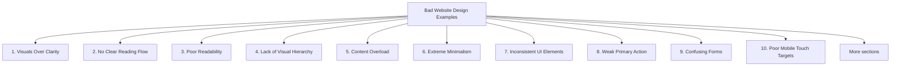

# Bad Website Design Examples

Bad website design happens when a website makes it difficult for users to understand, navigate, read, or complete tasks. A bad website may still function technically, but it fails from a usability and user experience point of view.

Common problems include:

- unclear purpose
- confusing navigation
- poor visual hierarchy
- cluttered layout
- weak readability
- low contrast
- inconsistent UI elements
- hidden or unclear actions
- poor mobile usability
- confusing forms

Each example below is rendered inside a sandboxed frame so the sample HTML is separated from the rest of the notes site.

## 1. Visuals Over Clarity

Some websites focus too much on artistic presentation and forget the user's main goal.

Example problem:

A restaurant website may look visually creative, but users cannot quickly find:

- menu
- booking button
- location
- opening hours

Bad rendered example:



  <header>
    <h1 class="huge-logo">BRAND</h1>
  </header>

  <main>
    

      
Experience the essence of taste through fire and form.

    

    <nav>
      <a href="#">01</a>
      <a href="#">02</a>
      <a href="#">03</a>
    </nav>
  </main>



Why this is bad:

- The website does not clearly explain what it is.
- Navigation labels are unclear.
- Important actions are hidden.
- Users must work too hard to find basic information.

Better rendered example:


<header>
  <h1>BRUTO Restaurant</h1>

  <nav>
    <a href="/menu">Menu</a>
    <a href="/reservations">Reserve a Table</a>
    <a href="/location">Location</a>
  </nav>
</header>


## 2. No Clear Reading Flow

Some websites use experimental layouts with scattered text, moving images, vertical labels, and unusual placement.

Bad rendered example:


<main class="collage-layout">
  
Menu

  
  
Seasonal tasting experience

  <a class="hidden-link" href="/book">Book</a>
</main>


Why this is bad:

- Users do not know where to look first.
- Important links are not obvious.
- Decorative layout interferes with usability.
- The website feels confusing instead of helpful.

Better rendered example:


<main>
  <section>
    <h1>Seasonal Tasting Menu</h1>
    
Book a multi-course dining experience.

    <a href="/book" class="primary-button">Book a Table</a>
  </section>
</main>


## 3. Poor Readability

Readability problems happen when text is hard to read because of bad color, spacing, font choice, or layout.

Bad rendered example:


<section style="background: repeating-linear-gradient(45deg, #111, #111 8px, #555 8px, #555 16px); color: lime; padding: 1rem;">
  

    Welcome to our website. Here you can find information about our services,
    history, contact details, updates, events, and announcements.
  

</section>


Why this is bad:

- Bright text on a busy background is hard to read.
- Large text blocks become tiring.
- Poor contrast reduces accessibility.
- Users may leave before reading the content.

Better rendered example:


<section style="background-color: #111; color: white; padding: 1rem;">
  <h1>About Us</h1>
  

    Learn about our services, history, events, and contact information.
  

</section>


## 4. Lack of Visual Hierarchy

A website has poor hierarchy when everything looks equally important.

Bad rendered example:


<main>
  <a href="#">Jobs</a>
  <a href="#">Housing</a>
  <a href="#">Services</a>
  <a href="#">Community</a>
  <a href="#">For Sale</a>
  <a href="#">Discussion Forums</a>
  <a href="#">Events</a>
</main>


Why this is bad:

- All links have the same visual weight.
- Users cannot quickly identify important sections.
- The page feels like a wall of links.
- New users receive little guidance.

Better rendered example:


<main>
  <h1>Find What You Need</h1>

  <section>
    <h2>Main Categories</h2>
    <a href="/jobs">Jobs</a>
    <a href="/housing">Housing</a>
    <a href="/services">Services</a>
  </section>

  <section>
    <h2>More</h2>
    <a href="/community">Community</a>
    <a href="/events">Events</a>
  </section>
</main>


## 5. Content Overload

Some websites try to show too much information at once.

Bad rendered example:


<section>
  <h1>Government Services</h1>

  

    <a href="#">Governor</a>
    <a href="#">News</a>
    <a href="#">Taxes</a>
    <a href="#">Licenses</a>
    <a href="#">Jobs</a>
    <a href="#">Education</a>
    <a href="#">Health</a>
    <a href="#">Transport</a>
    <a href="#">Public Safety</a>
  

</section>


Why this is bad:

- Too many options compete for attention.
- Users must search instead of being guided.
- Dense link panels feel cluttered.
- Important services are not prioritized.

Better rendered example:


<section>
  <h1>How Can We Help?</h1>

  

    <a href="/renew-license">Renew Driver License</a>
    <a href="/pay-taxes">Pay Taxes</a>
    <a href="/find-job">Find Jobs</a>
    <a href="/health-services">Health Services</a>
  

</section>


## 6. Extreme Minimalism

Minimal design becomes bad when it removes too much context.

Bad rendered example:


<main>
  <a href="#">Annual Report</a> 
  <a href="#">Letters</a> 
  <a href="#">News</a> 
  <a href="#">Contact</a> 
</main>


Why this is bad:

- The site may look unfinished.
- There is no clear structure.
- Users may think the page failed to load.
- The design does not match modern expectations.

Better rendered example:


<header>
  <h1>Berkshire Hathaway</h1>
  
Official company information and investor resources.

</header>

<main>
  <section>
    <h2>Investor Resources</h2>
    <a href="/annual-report">Annual Report</a>
    <a href="/letters">Shareholder Letters</a>
  </section>
</main>


## 7. Inconsistent UI Elements

Inconsistency happens when buttons, colors, fonts, spacing, and components change without reason.

Bad rendered example:


<button style="background: blue; border-radius: 4px;">Submit</button>
<button style="background: green; border-radius: 30px;">Cancel</button>
<button style="background: red; font-family: serif;">Continue</button>


Why this is bad:

- Users cannot predict how elements behave.
- The interface feels unprofessional.
- Different styles send mixed signals.
- It reduces trust.

Better rendered example:


<button class="button button-primary">Submit</button>
<button class="button button-secondary">Cancel</button>
<button class="button button-primary">Continue</button>


## 8. Weak Primary Action

A common UI mistake is making primary and secondary actions look the same.

Bad rendered example:



  <button>Cancel</button>
  <button>Delete Account</button>



Why this is bad:

- The dangerous or important action is not clearly distinguished.
- Users may click the wrong button.
- The interface does not guide decision-making.

Better rendered example:



  <button class="secondary">Cancel</button>
  <button class="danger">Delete Account</button>



## 9. Confusing Forms

Bad forms do not guide users properly before or after submission.

Bad rendered example:


<form>
  <input type="email" placeholder="Email">
  <input type="password" placeholder="Password">

  
Error

  <button>Submit</button>
</form>


Why this is bad:

- The error message is vague.
- It only uses color to communicate the problem.
- The user does not know how to fix the issue.

Better rendered example:


<form>
  <label for="email">Email address</label>
  <input id="email" type="email" aria-describedby="email-error">

  

    Enter a valid email address, for example name@example.com.
  

  <button>Create Account</button>
</form>


## 10. Poor Mobile Touch Targets

Small clickable areas are bad for mobile users.

Bad rendered example:


<nav>
  <a href="/home">Home</a>
  <a href="/menu">Menu</a>
  <a href="/contact">Contact</a>
</nav>


Why this is bad:

- Links may be too small to tap accurately.
- Users can tap the wrong item.
- Mobile navigation becomes frustrating.

Better rendered example:


<nav class="mobile-nav">
  <a class="touch-target" href="/home">Home</a>
  <a class="touch-target" href="/menu">Menu</a>
  <a class="touch-target" href="/contact">Contact</a>
</nav>


## 11. Bad Date Input Pattern

A bad date input can make simple tasks harder, especially on mobile.

Bad rendered example:


<label>Date of birth</label>

<select>
  <option>Day</option>
</select>

<select>
  <option>Month</option>
</select>

<select>
  <option>Year</option>
</select>


Why this is bad:

- Long dropdowns are slow.
- Selecting years can be frustrating.
- It increases effort for a simple input.

Better rendered example:


<fieldset>
  <legend>Date of birth</legend>

  <label>
    Day
    <input type="text" inputmode="numeric" maxlength="2">
  </label>

  <label>
    Month
    <input type="text" inputmode="numeric" maxlength="2">
  </label>

  <label>
    Year
    <input type="text" inputmode="numeric" maxlength="4">
  </label>
</fieldset>


## 12. Wrong Control Type

Using the wrong input control creates confusion.

Bad rendered example:


<form>
  <h2>Video Settings</h2>

  <label>
    <input type="checkbox">
    Autoplay
  </label>

  <label>
    <input type="checkbox">
    Subtitles
  </label>

  <button>Save</button>
</form>


Why this can be bad:

- Checkboxes with a Save button suggest changes happen later.
- For immediate settings, toggle switches are clearer.
- The control does not match the behavior.

Better rendered example:


<section>
  <h2>Video Settings</h2>

  <label>
    Autoplay
    <input type="checkbox" role="switch">
  </label>

  <label>
    Subtitles
    <input type="checkbox" role="switch">
  </label>
</section>


## Final Notes

Bad website design is not only about ugly visuals. A website is badly designed when users cannot easily understand what it is, where to go, what to click, or how to complete their goal.

A better website should:

- make the main purpose obvious
- use clear navigation
- show strong visual hierarchy
- keep text readable
- avoid unnecessary clutter
- use consistent UI elements
- support mobile users
- give clear feedback
- make forms simple and understandable

Source: [DesignRush: Bad Website Design Examples][1]

[1]: https://www.designrush.com/agency/website-design-development/trends/bad-websites "Bad Website Design Examples: 21 Sites and What Went Wrong"
