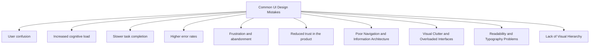

# Common UI Design Mistakes

UI (User Interface) design mistakes occur when interface elements make it harder for users to understand, navigate, or interact with a system. Even visually attractive interfaces can create a poor user experience if they fail to support user goals effectively.

Many UI problems arise because designers focus on aesthetics, trends, or technical implementation without considering how real users think and behave. A good interface should be intuitive, predictable, efficient, and accessible.

Common UI design mistakes often lead to:

- User confusion
- Increased cognitive load
- Slower task completion
- Higher error rates
- Frustration and abandonment
- Reduced trust in the product

Some of the most frequent UI design issues include:

- Poor Navigation & Information Architecture
- Visual Clutter and Overloaded Interfaces
- Readability and Typography Problems
- Lack of Visual Hierarchy
- Mobile Responsiveness Issues
- Accessibility and Usability Problems

These problems are often interconnected. For example, a cluttered interface can reduce readability, poor hierarchy can make navigation difficult, and accessibility issues can prevent some users from interacting with the system altogether.

Effective UI design aims to reduce friction by helping users quickly understand:

- Where they are
- What actions are available
- What information is important
- What will happen when they interact with the interface

The goal of good UI design is not simply to make an interface look attractive, but to make interactions clear, efficient, and easy to understand for all users.
