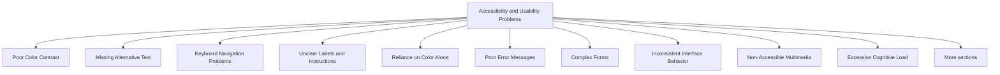

# Accessibility and Usability Problems

Accessibility and usability are closely related concepts that focus on making systems easy and effective for people to use.

- **Accessibility** ensures that people with disabilities can access and use a system.
- **Usability** ensures that users can efficiently and effectively complete their tasks with minimal effort.

A website may function correctly, but if users cannot understand it, navigate it, read it, or interact with it successfully, the design has failed.

Common accessibility and usability problems include:

- Poor color contrast
- Missing alternative text for images
- Keyboard navigation issues
- Unclear labels and instructions
- Inconsistent interface behavior
- Poor error messages
- Reliance on color alone
- Complex forms
- Non-accessible multimedia
- Excessive cognitive load



## Poor Color Contrast

Text should be clearly distinguishable from its background.

Bad:


<p style="color:#d0d0d0;background:white">
Important account information.
</p>


Problem:

- Difficult to read.
- Users with visual impairments may struggle.
- Accessibility standards may not be met.

Better:


<p style="color:#222;background:white">
Important account information.
</p>


High contrast improves readability for everyone.

## Missing Alternative Text

Screen readers rely on alternative text to describe images.

Bad:





Problem:

- Screen reader users receive no information about the image.
- Important content may be completely inaccessible.

Better:





Alternative text provides meaningful descriptions.

## Keyboard Navigation Problems

Many users navigate using only a keyboard.

Bad:


<div onclick="submitForm()">
  Submit
</div>


Problem:

- The element may not be reachable using the keyboard.
- Some users cannot activate the control.

Better:


<button>
  Submit
</button>


Native controls support keyboard interaction automatically.

## Unclear Labels and Instructions

Users should immediately understand what information is required.

Bad:


<input type="text">


Problem:

- Users do not know what the field expects.
- Forms become confusing.

Better:


<label for="email">
  Email Address
</label>

<input id="email" type="email">


Clear labels improve usability and accessibility.

## Reliance on Color Alone

Important information should not depend entirely on color.

Bad:


<p style="color:red">
Required Field
</p>


Problem:

- Color-blind users may not notice the distinction.
- Information may be lost.

Better:


<p>
  * Required Field
</p>


Use text, icons, or symbols in addition to color.

## Poor Error Messages

Error messages should explain both the problem and the solution.

Bad:


Error


Problem:

- Users do not know what went wrong.
- No guidance is provided.

Better:


Password must contain at least
8 characters.


Users understand the issue and how to fix it.

## Complex Forms

Long or complicated forms increase user frustration.

Bad:


<form>
  <input>
  <input>
  <input>
  <input>
  <input>
  <input>
  <input>
  <input>
</form>


Problem:

- Users may abandon the form.
- Error rates increase.
- Completion time becomes longer.

Better:


<form>
  <label>Name</label>
  <input>

  <label>Email</label>
  <input>

  <label>Phone</label>
  <input>
</form>


Keep forms simple and organized.

## Inconsistent Interface Behavior

Users expect similar elements to behave similarly.

Bad:

Page 1:


<button>Save</button>


Page 2:


<a>Save</a>


Problem:

- Users become uncertain about how controls work.
- Predictability decreases.

Better:

Use the same design and behavior for identical actions throughout the system.

## Non-Accessible Multimedia

Videos and audio should be accessible to all users.

Bad:


<video src="tutorial.mp4"></video>


Problem:

- Deaf or hard-of-hearing users may miss information.
- Accessibility is reduced.

Better:


<video controls>
  <track
    kind="captions"
    src="captions.vtt">
</video>


Captions improve accessibility and usability.

## Excessive Cognitive Load

Users should not be forced to remember large amounts of information.

Bad:

```text
Step 1: Read instructions
Step 2: Navigate elsewhere
Step 3: Return and enter information from memory
```

Problem:

- Increases mental effort.
- Leads to mistakes.
- Slows task completion.

Better:

```text
Display instructions and required information
on the same screen where the task is performed.
```

Reduce the amount users must remember.

## Accessibility vs Usability

| Accessibility | Usability |
|--------------|-----------|
| Focuses on making systems usable for people with disabilities | Focuses on making systems easy for everyone to use |
| Often guided by standards such as WCAG | Often guided by usability principles and user testing |
| Ensures equal access | Ensures efficient task completion |
| Addresses barriers to interaction | Addresses ease of interaction |

## Characteristics of Accessible and Usable Interfaces

Good interfaces should:

- Be easy to read
- Work with keyboard navigation
- Support screen readers
- Provide clear labels and instructions
- Offer meaningful feedback
- Use accessible color contrast
- Include captions and alternative text
- Minimize cognitive load
- Be consistent and predictable
- Help users recover from errors

Accessibility and usability ultimately share the same goal: enabling users to complete tasks effectively, efficiently, and with minimal frustration regardless of their abilities, experience, or device.
