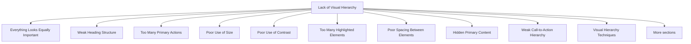

# Lack of Visual Hierarchy

Visual hierarchy is the arrangement of interface elements in a way that communicates their importance. It helps users understand where to look first, what information is most important, and which actions should be performed next.

Users do not read interfaces from top to bottom like a book. Instead, they scan pages and make decisions based on visual cues such as size, color, contrast, spacing, position, and emphasis.

When visual hierarchy is missing or poorly implemented, users struggle to understand the interface and may overlook important information or actions.

Common causes of poor visual hierarchy include:

- Everything looks equally important
- Similar sizes for all elements
- Poor use of color and contrast
- Lack of spacing
- Too many highlighted elements
- Weak distinction between headings and content
- Multiple competing call-to-action buttons
- Poor placement of important information

## Everything Looks Equally Important

When all elements have the same visual weight, users cannot determine where to focus.

Bad:


<h2>Products</h2>
<h2>Pricing</h2>
<h2>Support</h2>
<h2>Contact</h2>


Problem:

- No element stands out.
- Users receive no guidance.
- Important content is difficult to identify.

Better:


<h1>Choose Your Plan</h1>

<h2>Pricing Options</h2>

Select the plan that best suits your needs.



The most important information receives the greatest emphasis.

## Weak Heading Structure

Headings should clearly separate sections and indicate importance.

Bad:


<h3>Company Information</h3>

...

<h3>Pricing</h3>

...

<h3>Contact</h3>


Problem:

- All sections appear equally important.
- Users cannot quickly identify the main topic.
- Content becomes harder to scan.

Better:


<h1>Our Services</h1>

<h2>Pricing</h2>

<h2>Company Information</h2>

<h2>Contact</h2>


A clear heading hierarchy improves navigation and understanding.

## Too Many Primary Actions

Interfaces should guide users toward a primary goal.

Bad:


<button>Buy Now</button>
<button>Start Trial</button>
<button>Watch Demo</button>
<button>Subscribe</button>
<button>Contact Sales</button>


Problem:

- Users face multiple competing choices.
- The intended action is unclear.
- Decision-making becomes slower.

Better:


<button>Start Free Trial</button>

<a href="#">Watch Demo</a>


One action receives primary emphasis while others remain secondary.

## Poor Use of Size

Size naturally attracts attention.

Bad:


<h2>Welcome</h2>

Special Offer - 50% Off Today!



Problem:

- The promotion may be overlooked.
- Important information does not stand out.

Better:


<h1>50% Off Today</h1>

Limited-time promotion.



Larger elements draw attention first.

## Poor Use of Contrast

Contrast helps distinguish important elements from surrounding content.

Bad:


<button style="background:#eeeeee;color:#999999">
Buy Now
</button>


Problem:

- Important actions blend into the interface.
- Users may not notice clickable elements.

Better:


<button style="background:#0066ff;color:white">
Buy Now
</button>


Strong contrast highlights key actions.

## Too Many Highlighted Elements

If everything is emphasized, nothing is emphasized.

Bad:


<h1>Important</h1>

<strong>New Product</strong>

<strong>Special Offer</strong>

<strong>Latest News</strong>

<strong>Limited Time Deal</strong>



Problem:

- Every item competes for attention.
- Users cannot determine priorities.
- Emphasis loses its meaning.

Better:


<h1>Limited Time Deal</h1>

Save 50% this week.

View our latest products and updates below.



Highlight only the most important content.

## Poor Spacing Between Elements

Spacing helps users identify relationships between content.

Bad:


<h1>Products</h1>

Description

<h1>Services</h1>

Description

<h1>Contact</h1>

Description



Problem:

- Content appears crowded.
- Users cannot easily distinguish sections.
- The page feels disorganized.

Better:


<section>
  <h1>Products</h1>
  
Description

</section>

<section>
  <h1>Services</h1>
  
Description

</section>

<section>
  <h1>Contact</h1>
  
Description

</section>


White space helps separate content and improve comprehension.

## Hidden Primary Content

Important information should appear where users naturally look.

Bad:


Header

Advertisement

Advertisement

Advertisement

Main Content


Problem:

- Users must scroll to reach key information.
- Important content receives less attention than secondary elements.

Better:


Header

Main Content

Supporting Information

Footer


Primary content should be immediately visible.

## Weak Call-to-Action Hierarchy

Call-to-action (CTA) buttons should clearly indicate the preferred action.

Bad:


<button>Learn More</button>
<button>Sign Up</button>


Both buttons look identical.

Problem:

- Users cannot identify the recommended action.
- Conversion rates may decrease.

Better:


<button class="primary">
  Sign Up
</button>

<button class="secondary">
  Learn More
</button>


The primary action becomes obvious.

## Visual Hierarchy Techniques

Designers commonly create hierarchy using:

| Technique | Purpose |
|------------|----------|
| Size | Larger elements attract attention |
| Color | Highlights important content |
| Contrast | Separates elements from surroundings |
| Position | Elements placed higher are noticed first |
| White Space | Groups and separates information |
| Typography | Distinguishes headings and content |
| Alignment | Creates structure and order |
| Emphasis | Directs attention to key elements |

## Good Visual Hierarchy Principles

A good visual hierarchy should help users answer:

1. What is the most important thing on this page?
2. What should I look at next?
3. What action should I take?
4. How is the information organized?

Effective visual hierarchy reduces cognitive effort by guiding the user's attention naturally through the interface. Instead of forcing users to search for important information, the design makes priorities immediately obvious.
