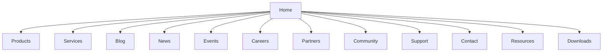
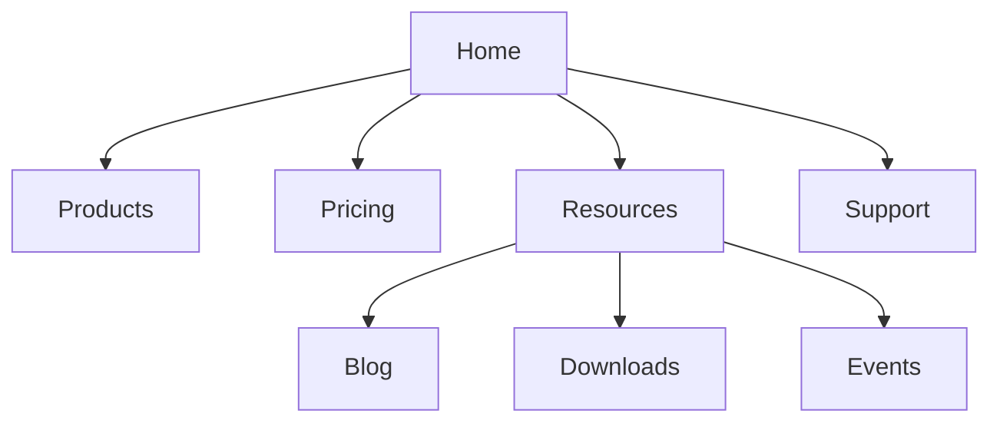
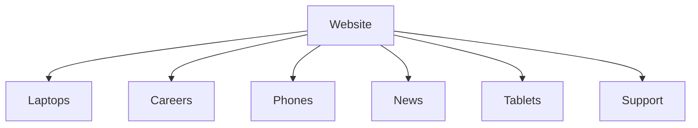
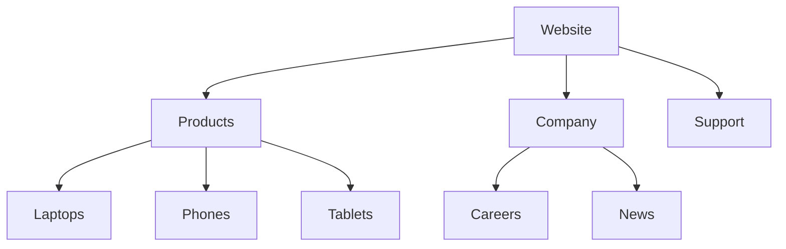
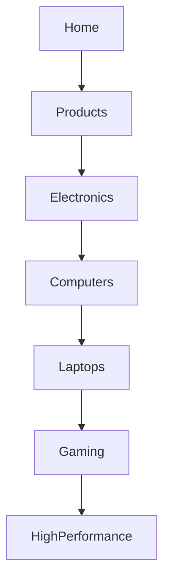
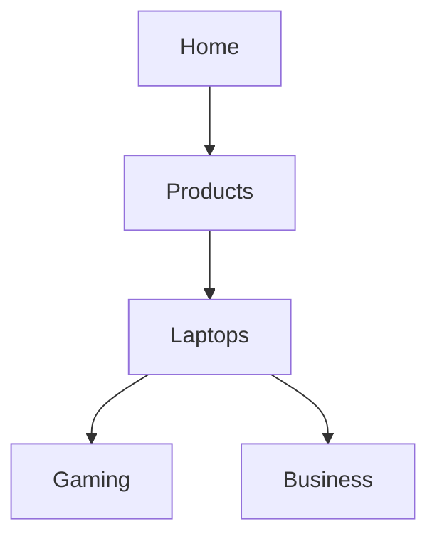
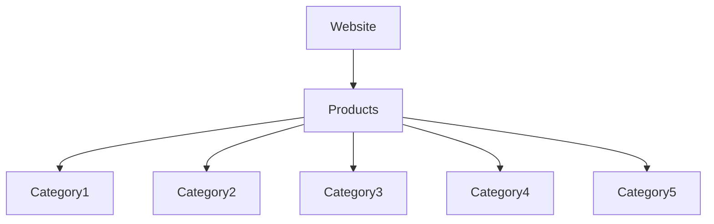
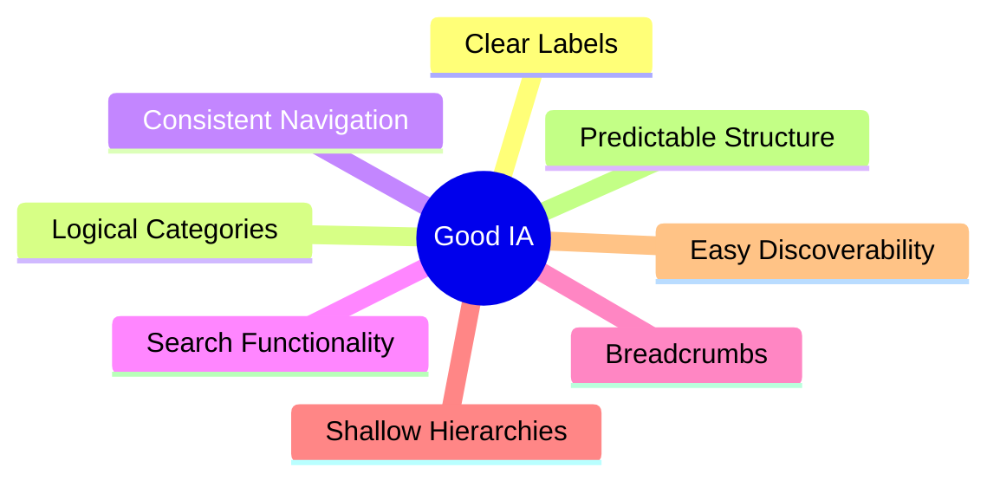

# Poor Navigation & Information Architecture

Navigation is how users move through a website or application. Information Architecture (IA) is the way content, features, and pages are organized so users can easily find information and complete tasks.

A website may contain useful content, but if users cannot locate it quickly, the design fails. Poor navigation and information architecture increase cognitive load, slow down task completion, and often cause users to leave the site.

Common navigation and IA problems include:

- Unclear menu labels
- Too many navigation choices
- Poor content organization
- Deep navigation hierarchies
- Missing search functionality
- Hidden navigation elements
- Lack of location indicators
- Inconsistent menus across pages

## Unclear Navigation Labels

Users should immediately understand where a menu item will take them.

Bad:


<nav>
  <a href="#">Explore</a>
  <a href="#">Discover</a>
  <a href="#">Solutions</a>
</nav>


Problem:

- Labels are ambiguous.
- Different users interpret them differently.
- Users must guess what each option contains.

Better:


<nav>
  <a href="#">Products</a>
  <a href="#">Pricing</a>
  <a href="#">Support</a>
</nav>


The destination of each link is obvious.

## Too Many Navigation Choices

Presenting too many options at once can overwhelm users.

Bad Structure:



Problem:

- Users face choice overload.
- Important options are harder to find.
- Decision-making becomes slower.

Better Structure:



Related content is grouped together.

## Poor Content Organization

Information should be grouped according to user expectations.

Bad Structure:



Problem:

- Related items are scattered.
- Categories lack logical structure.
- Users struggle to predict where information belongs.

Better Structure:



Content is grouped logically.

## Deep Navigation Hierarchies

Users should not have to click through many levels to reach important content.

Bad Structure:



Problem:

- Too many clicks.
- Users lose context.
- Navigation becomes inefficient.

Better Structure:



The hierarchy is flatter and easier to navigate.

## Missing Breadcrumbs

Users should always know where they are within a website.

Without breadcrumbs:

```text
Gaming Laptop X500
```

Users may not know which category the page belongs to.

With breadcrumbs:

```text
Home > Products > Laptops > Gaming Laptop X500
```

Benefits:

- Provides context.
- Improves navigation.
- Allows quick movement to higher levels.

## Hidden Navigation

Navigation should be visible and easy to discover.

Bad:


<button>☰</button>


Problem:

- Important sections become hidden.
- Some users may never open the menu.
- Discoverability decreases.

Better:


<nav>
  <a href="#">Products</a>
  <a href="#">Pricing</a>
  <a href="#">Support</a>
</nav>


Primary navigation remains visible.

## Missing Search Functionality

Large websites often require search capabilities.

Example:



Problem:

- Browsing thousands of items manually is inefficient.
- Users cannot directly access specific content.

Better:


<input
  type="search"
  placeholder="Search products..."
>


Search improves findability and reduces navigation effort.

## Inconsistent Navigation

Navigation should remain consistent throughout the entire website.

Bad:

Page 1


Products | Pricing | Support


Page 2


Services | Plans | Help


Problem:

- Similar content uses different names.
- Users must relearn the interface.
- Navigation becomes unpredictable.

Better:


Products | Pricing | Support


Use the same structure and terminology across all pages.

## Characteristics of Good Information Architecture



Good navigation helps users answer three questions at all times:

1. Where am I?
2. Where can I go?
3. How do I get back?
