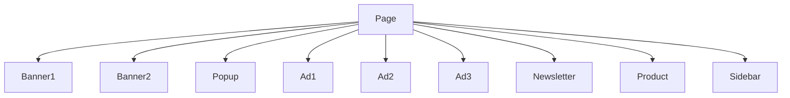
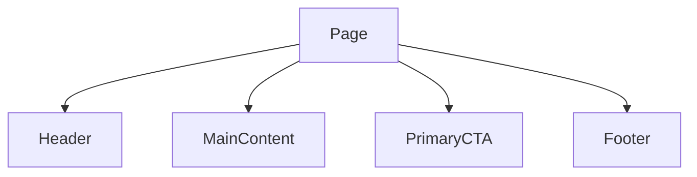
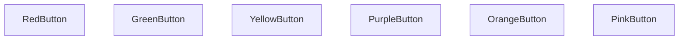
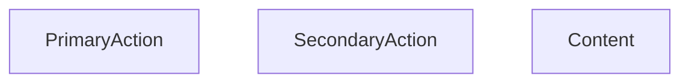
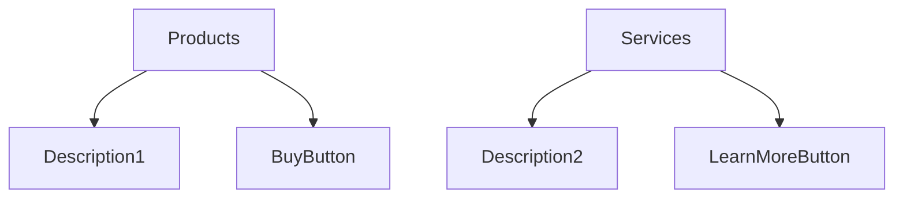
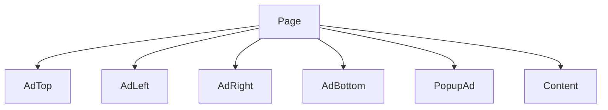
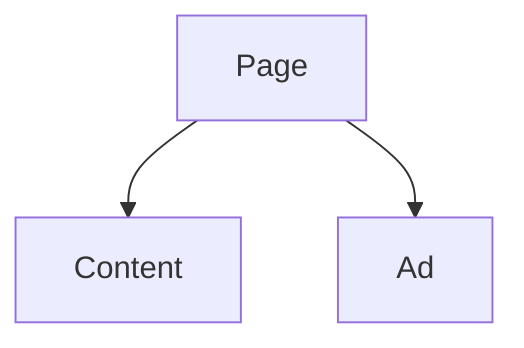
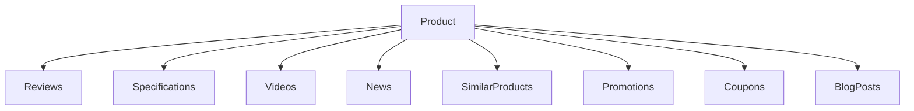
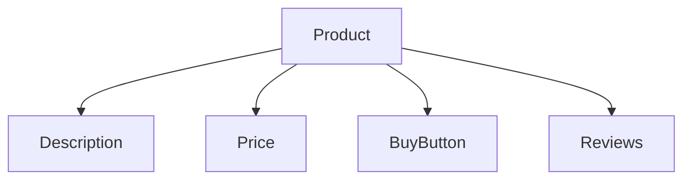
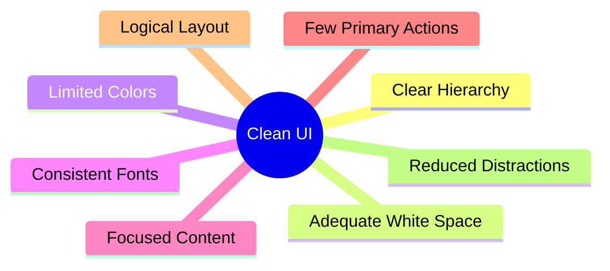

# Visual Clutter and Overloaded Interfaces

Visual clutter occurs when too many interface elements compete for the user's attention at the same time. An overloaded interface contains excessive information, controls, advertisements, colors, images, or text that make it difficult for users to focus on their primary task.

A cluttered interface increases cognitive load because users must spend extra effort deciding what is important and what can be ignored. Instead of guiding users toward their goals, the interface overwhelms them with choices and distractions.

Common causes of visual clutter include:

- Too many menu items
- Excessive text
- Too many buttons and actions
- Multiple advertisements
- Overuse of colors
- Too many fonts
- Large numbers of images or icons
- Poor spacing between elements
- Lack of content prioritization

## Too Many Competing Elements

When every element demands attention, users struggle to determine what is most important.

Bad Interface:

Problem:

- Users do not know where to focus.
- Important content becomes hidden among distractions.
- Decision-making becomes slower.

Better Interface:

The user's attention is directed toward the main task.

## Too Many Actions

Providing too many buttons can overwhelm users.

Bad:


<button>Buy Now</button>
<button>Subscribe</button>
<button>Compare</button>
<button>Wishlist</button>
<button>Share</button>
<button>Download</button>
<button>Learn More</button>
<button>View Demo</button>


Problem:

- Users experience choice overload.
- The primary action becomes unclear.
- Conversion rates may decrease.

Better:


<button>Buy Now</button>
<a href="#">Learn More</a>


One primary action is clearly emphasized.

## Excessive Text

Large blocks of uninterrupted text are difficult to scan.

Bad:



Lorem ipsum dolor sit amet consectetur adipisicing elit...



Problem:

- Users rarely read large text blocks.
- Important information gets buried.
- Scanning becomes difficult.

Better:


<h2>Features</h2>

<ul>
  <li>Fast performance</li>
  <li>Cloud synchronization</li>
  <li>Mobile support</li>
</ul>


Information becomes easier to consume.

## Poor Use of Colors

Using many bright colors creates visual noise.

Bad:

Problem:

- No visual hierarchy.
- Everything appears equally important.
- The interface feels chaotic.

Better:

Use a limited color palette with clear meaning.

Example:

- Blue → Primary actions
- Gray → Secondary actions
- Red → Errors or destructive actions

## Too Many Fonts

Using many font styles creates inconsistency.

Bad:


<h1 style="font-family: Arial">Title</h1>

Content

<button style="font-family: Comic Sans MS">
Submit
</button>


Problem:

- Interface appears unprofessional.
- Visual consistency is lost.
- Reading becomes harder.

Better:


<h1>Title</h1>

Content

<button>Submit</button>


Use one or two font families consistently.

## Lack of White Space

White space is the empty area between interface elements.

Bad:



<h1>Products</h1>
Description
<button>Buy</button>
<h1>Services</h1>
Description
<button>Learn More</button>



Problem:

- Elements appear crowded.
- Users cannot easily separate content sections.
- Reading becomes more difficult.

Better Layout:

Adequate spacing improves readability and organization.

## Advertisement Overload

Many websites place too many advertisements around the main content.

Bad Structure:

Problem:

- Content becomes secondary.
- Users may become frustrated.
- Trust and usability decrease.

Better Structure:

Advertisements should not interfere with core tasks.

## Information Overload

Displaying too much information at once makes decision-making difficult.

Bad Product Page:

Problem:

- Users struggle to identify essential information.
- Important content gets buried.
- Cognitive load increases.

Better Product Page:

Important information is prioritized.

## Characteristics of a Clean Interface

A clean interface does not necessarily mean a minimal interface. The goal is to present information in a way that allows users to quickly identify what is important, understand available actions, and complete tasks without unnecessary distractions.
