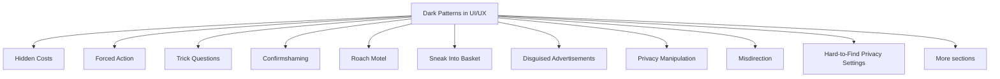

# Dark Patterns in UI/UX

Dark patterns are interface design techniques that intentionally manipulate, mislead, or pressure users into making decisions that benefit the organization rather than the user.

Unlike good UX design, which helps users achieve their goals, dark patterns exploit human psychology to influence behavior, increase conversions, collect data, or generate revenue.

While dark patterns may improve short-term business metrics, they often reduce trust, harm user experience, and can lead to legal or ethical concerns.

Common dark patterns include:

- Hidden costs
- Forced actions
- Trick questions
- Confirmshaming
- Roach motels
- Sneak into basket
- Disguised advertisements
- Privacy manipulation
- Hard-to-cancel subscriptions
- Misdirection



## Hidden Costs

Additional fees are revealed only near the end of a process.

Example:

```text
Product Price: $50

Checkout:
Product: $50
Service Fee: $8
Processing Fee: $5
Delivery Fee: $7

Total: $70
```

Problem:

- Users make decisions using incomplete information.
- Costs are intentionally hidden until commitment increases.

Better:

```text
Product Price: $70
(Includes all fees)
```

Users should see the full cost upfront.

## Forced Action

Users are required to perform an unrelated action to continue.

Example:

```text
Create Account

☐ Subscribe to newsletter
```

The user cannot continue unless the box is selected.

Problem:

- Removes user choice.
- Forces unwanted actions.

Better:

```text
Create Account

☐ Subscribe to newsletter (Optional)
```

Users should be free to choose.

## Trick Questions

Questions are written in confusing ways that encourage accidental choices.

Example:

```text
☐ Uncheck this box if you do not want to stop receiving promotional emails.
```

Problem:

- Requires unnecessary mental effort.
- Users may select the wrong option unintentionally.

Better:

```text
☐ Receive promotional emails
```

The meaning should be obvious.

## Confirmshaming

Users are made to feel guilty for declining an option.

Example:

```text
Yes, I want to save money.

No, I prefer paying full price.
```

Problem:

- Uses emotional pressure.
- Attempts to manipulate user decisions.

Better:

```text
Accept Offer

Decline Offer
```

Options should remain neutral.

## Roach Motel

It is easy to enter a service but difficult to leave it.

Example:

```text
Subscribe:
1 Click

Cancel:
Settings
 → Account
 → Subscription
 → Support Form
 → Email Confirmation
 → Final Confirmation
```

Problem:

- Creates unnecessary barriers.
- Intentionally discourages cancellation.

Better:

```text
Subscribe:
1 Click

Cancel:
1 Click
```

Leaving should be as easy as joining.

## Sneak Into Basket

Additional products or services are automatically added during checkout.

Example:

```text
✓ Travel Insurance Added
✓ Extended Warranty Added
```

Problem:

- Users may purchase items unintentionally.
- Relies on inattention.

Better:

```text
☐ Add Travel Insurance

☐ Add Extended Warranty
```

Optional purchases should require explicit consent.

## Disguised Advertisements

Advertisements are designed to look like normal content or interface controls.

Example:

```text
Download

Download

Download
```

Only one button is the actual download link.

Problem:

- Users are deceived.
- Trust is reduced.

Better:

```text
Download File

Advertisement
```

Advertisements should be clearly identified.

## Privacy Manipulation

Interfaces encourage users to share more data than necessary.

Example:

```text
Allow Access to:

✓ Contacts
✓ Location
✓ Camera
✓ Microphone
✓ Photos
```

Problem:

- Users may not understand what data is being collected.
- Privacy choices become unclear.

Better:

```text
Location Access Required
Purpose:
Show nearby stores.
```

Users should understand what data is collected and why.

## Misdirection

Visual design is used to direct attention toward a preferred choice.

Example:


<button style="font-size:24px">
Accept All Cookies
</button>

<a href="#">
Manage Settings
</a>


Problem:

- One option dominates attention.
- Alternative choices are intentionally minimized.

Better:


<button>
Accept All Cookies
</button>

<button>
Manage Settings
</button>


Choices should receive equal visibility.

## Hard-to-Find Privacy Settings

Privacy controls are intentionally hidden within complex menus.

Example:

```text
Settings
 → Account
   → Preferences
     → Advanced
       → Privacy
```

Problem:

- Users struggle to control their data.
- Important settings become difficult to access.

Better:

```text
Settings
 → Privacy
```

Frequently used settings should be easy to locate.

## False Urgency

Interfaces create artificial pressure to encourage immediate action.

Example:

```text
Only 1 Room Left!

Offer Ends in 5 Minutes!
```

When the warning is not genuine.

Problem:

- Manipulates decision-making.
- Encourages impulsive actions.

Better:

Provide accurate availability and deadlines only when they are real.

## Why Dark Patterns Work

Dark patterns exploit common human behaviors such as:

- Inattention
- Habit
- Trust in interfaces
- Fear of missing out (FOMO)
- Desire for convenience
- Aversion to loss
- Decision fatigue

Because users often scan rather than read carefully, they can be influenced by misleading designs.

## Ethical Design vs Dark Patterns

| Ethical Design | Dark Patterns |
|----------------|--------------|
| Supports user goals | Supports business goals at the user's expense |
| Transparent | Misleading |
| Informed consent | Manipulated consent |
| Easy to understand | Intentionally confusing |
| Respects user choice | Pressures user decisions |
| Builds trust | Exploits trust |

## Characteristics of Ethical UI Design

Good interfaces should:

- Be honest and transparent
- Clearly communicate costs
- Respect user choices
- Make cancellation easy
- Protect user privacy
- Avoid manipulation
- Provide informed consent
- Support user goals
- Build long-term trust

Dark patterns may increase short-term conversions, but they often damage user trust, reduce satisfaction, and create negative perceptions of a product or organization.
