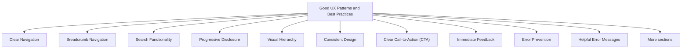

# Good UX Patterns and Best Practices

UX patterns are reusable solutions to common design problems. They are established interaction approaches that help users complete tasks efficiently, consistently, and predictably.

A good UX pattern is not simply a design trend. It is a proven solution that has been shown through research, testing, and repeated use to improve usability and user experience.

Best practices are general guidelines that help designers create interfaces that are intuitive, accessible, and user-friendly.

The purpose of UX patterns is to reduce learning effort by allowing users to interact with familiar and predictable interfaces.



## Clear Navigation

Users should always know:

- Where they are
- Where they can go
- How to return

Good Example:


<nav>
  <a href="#">Products</a>
  <a href="#">Pricing</a>
  <a href="#">Support</a>
</nav>


Benefits:

- Easy exploration
- Reduced confusion
- Faster task completion

## Breadcrumb Navigation

Breadcrumbs help users understand their location within a website.

Example:

```text
Home > Products > Laptops > Gaming Laptop
```

Benefits:

- Provides context
- Supports navigation
- Reduces disorientation

## Search Functionality

Large websites should provide search capabilities.

Example:


<input
  type="search"
  placeholder="Search..."
>


Benefits:

- Faster information retrieval
- Improved discoverability
- Reduced navigation effort

## Progressive Disclosure

Show only essential information initially and reveal advanced options when needed.

Bad:


<form>
  20 different settings
</form>


Better:


<form>
  Basic Settings

  <button>
    Advanced Settings
  </button>
</form>


Benefits:

- Reduced cognitive load
- Cleaner interfaces
- Easier learning

## Visual Hierarchy

Important information should stand out.

Example:


<h1>Start Your Free Trial</h1>

<button>
  Sign Up
</button>


Benefits:

- Guides attention
- Highlights important actions
- Improves decision-making

## Consistent Design

Similar elements should look and behave similarly.

Example:


<button class="primary">
  Save
</button>

<button class="primary">
  Submit
</button>


Benefits:

- Predictability
- Reduced learning effort
- Improved usability

## Clear Call-to-Action (CTA)

Users should easily identify the primary action.

Bad:


<button>Learn More</button>
<button>Buy</button>
<button>Subscribe</button>
<button>Demo</button>


Better:


<button>
  Start Free Trial
</button>


Benefits:

- Clear direction
- Reduced decision fatigue
- Improved conversions

## Immediate Feedback

The system should respond to user actions.

Example:

```text
✓ File Uploaded Successfully
```

Benefits:

- Confirms actions
- Reduces uncertainty
- Builds confidence

## Error Prevention

Prevent mistakes before they occur.

Example:


<input
  type="email"
  required>


Benefits:

- Fewer user errors
- Faster task completion
- Reduced frustration

## Helpful Error Messages

When errors occur, explain both the problem and solution.

Bad:

```text
Error
```

Better:

```text
Password must contain at least
8 characters.
```

Benefits:

- Easier recovery
- Less frustration
- Improved success rates

## Accessible Design

Interfaces should be usable by people with different abilities.

Example:





Benefits:

- Supports screen readers
- Improves accessibility
- Expands usability

## Mobile-Friendly Design

Interfaces should adapt to different screen sizes.

Example:





Benefits:

- Better mobile experience
- Improved usability
- Consistent interaction across devices

## Recognition Over Recall

Users should recognize options rather than remember information.

Bad:

```text
Remember product code:
A7X-349-Q
```

Better:

```text
Select Product:
▼ Gaming Mouse
```

Benefits:

- Lower cognitive load
- Faster interaction
- Fewer mistakes

## Default Values

Provide sensible defaults whenever possible.

Example:


<select>
  <option selected>
    Pakistan
  </option>
</select>


Benefits:

- Faster completion
- Reduced effort
- Improved efficiency

## Simple Forms

Ask only for information that is necessary.

Bad:

```text
Name
Email
Phone
Address
Occupation
Company
Age
Website
```

Better:

```text
Name
Email
```

Benefits:

- Higher completion rates
- Reduced abandonment
- Better user experience

## Familiar Design Patterns

Users should encounter interactions they already understand.

Examples:

```text
🔍 Search

🛒 Cart

⚙ Settings

☰ Menu
```

Benefits:

- Faster learning
- Reduced confusion
- Improved efficiency

## User Control and Freedom

Users should be able to undo actions and recover from mistakes.

Example:

```text
File Deleted

Undo
```

Benefits:

- Increased confidence
- Reduced anxiety
- Better error recovery

## Good UX Principles Summary

| Principle | Purpose |
|------------|----------|
| Clear Navigation | Help users move through the system |
| Breadcrumbs | Show current location |
| Search | Improve findability |
| Progressive Disclosure | Reduce complexity |
| Visual Hierarchy | Direct attention |
| Consistency | Improve predictability |
| Clear CTA | Guide user actions |
| Feedback | Confirm actions |
| Error Prevention | Reduce mistakes |
| Error Recovery | Help users recover |
| Accessibility | Support all users |
| Mobile Responsiveness | Support different devices |
| Recognition Over Recall | Reduce memory load |
| Defaults | Improve efficiency |
| Simple Forms | Reduce effort |
| Familiar Patterns | Improve learnability |
| User Control | Support recovery and confidence |

Good UX patterns exist because users encounter similar problems across many systems. By using established patterns and best practices, designers create interfaces that are easier to learn, easier to use, and more satisfying for users.
