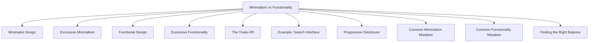

# Minimalism vs Functionality

Minimalism and functionality are two important considerations in UI and UX design.

- **Minimalism** focuses on simplicity by removing unnecessary elements and reducing visual complexity.
- **Functionality** focuses on providing the features, controls, and information users need to complete their tasks.

A successful design balances both. Too much functionality can create clutter and complexity, while excessive minimalism can remove important information and make the interface difficult to use.

The goal is not to remove as much as possible, but to remove only what does not help the user.

## Minimalist Design

Minimalist interfaces emphasize:

- Simplicity
- Clean layouts
- Limited color palettes
- Reduced visual distractions
- Focus on essential content

Example:


<header>
  <h1>Weather App</h1>
</header>

<main>
  <h2>28°C</h2>
  
Sunny

</main>


Benefits:

- Easy to understand
- Faster visual scanning
- Reduced cognitive load
- Modern appearance

However, minimalism can become problematic when important functionality is removed.

## Excessive Minimalism

Bad:


<button>
  +
</button>


Problem:

- Users may not know what the button does.
- Important context is missing.
- Discoverability decreases.

Another example:


<nav>
  ☰
</nav>


Problem:

- Navigation is hidden.
- Users may not discover available options.
- Important actions become harder to access.

In these cases, simplicity reduces usability.

## Functional Design

Functional design prioritizes helping users complete tasks effectively.

Example:


<form>
  <label>Email</label>
  <input type="email">

  <label>Password</label>
  <input type="password">

  <button>Login</button>
</form>


Benefits:

- Clear purpose
- Easy interaction
- Good task support
- High usability

The interface provides everything required to complete the task.

## Excessive Functionality

Adding too many features can overwhelm users.

Bad:


<button>Save</button>
<button>Export</button>
<button>Print</button>
<button>Share</button>
<button>Compare</button>
<button>Download</button>
<button>Duplicate</button>
<button>Archive</button>


Problem:

- Too many choices.
- Important actions become difficult to identify.
- Increased cognitive load.

Users may spend more time deciding what to do than actually completing the task.

## The Trade-Off

Designers often face a trade-off between simplicity and capability.

| More Minimal | More Functional |
|-------------|----------------|
| Fewer elements | More features |
| Cleaner appearance | Greater capability |
| Easier scanning | More task support |
| Lower cognitive load | Higher complexity |
| Better aesthetics | Better feature coverage |

Neither side is automatically better.

The appropriate balance depends on:

- User goals
- User experience level
- Task complexity
- Context of use

## Example: Search Interface

Overly Functional:


<form>
  <input>

  <select>Category</select>

  <select>Location</select>

  <select>Price</select>

  <select>Rating</select>

  <select>Date</select>

  <button>Search</button>
</form>


Problem:

- Too many options initially.
- New users may feel overwhelmed.

Overly Minimal:


<input placeholder="Search">


Problem:

- Users cannot refine results.
- Important functionality is missing.

Balanced Design:


<input placeholder="Search">

<button>Filters</button>


Users can search immediately while advanced options remain available when needed.

## Progressive Disclosure

A common solution is **progressive disclosure**.

Progressive disclosure means showing only the most important information and controls initially, while revealing advanced options when users need them.

Example:


<input placeholder="Search">

<button>
  Advanced Filters
</button>


Benefits:

- Keeps the interface simple.
- Preserves advanced functionality.
- Reduces cognitive load.
- Supports both novice and expert users.

## Common Minimalism Mistakes

- Hiding navigation unnecessarily
- Replacing text labels with unclear icons
- Removing helpful instructions
- Eliminating important feedback
- Using excessive whitespace without purpose
- Prioritizing appearance over usability

## Common Functionality Mistakes

- Adding unnecessary features
- Showing all options at once
- Creating crowded interfaces
- Using too many buttons and controls
- Increasing complexity without user benefit
- Ignoring visual hierarchy

## Finding the Right Balance

Good interfaces:

- Keep essential actions visible
- Remove unnecessary distractions
- Provide required functionality
- Support user goals efficiently
- Avoid unnecessary complexity
- Maintain clarity and discoverability

The objective of UI design is not maximum simplicity or maximum functionality. The objective is to provide the right amount of functionality with the lowest possible complexity.
