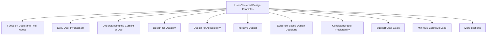

# User-Centered Design Principles

User-Centered Design (UCD) is a design approach that places users at the center of the design and development process. Rather than designing based on assumptions, designers focus on understanding users, their needs, goals, abilities, limitations, and environments.

The primary objective of UCD is to create systems that are useful, usable, accessible, and satisfying for the people who will actually use them.

User-centered design is an iterative process, meaning designs are continuously improved through feedback and evaluation.



## Focus on Users and Their Needs

Design decisions should be based on real user requirements rather than designer preferences or technical possibilities.

Example:

Bad Approach:

```text
"We think users want this feature."
```

User-Centered Approach:

```text
"We interviewed users and found they need this feature."
```

Design should be driven by evidence gathered from users.

## Early User Involvement

Users should participate throughout the design process, not only after development is complete.

Examples of user involvement:

- Interviews
- Surveys
- Observation
- Usability testing
- Feedback sessions

Benefits:

- Problems are discovered early.
- Requirements become more accurate.
- Development risks are reduced.

## Understanding the Context of Use

Designers must understand:

- Who the users are
- What tasks they perform
- Where they use the system
- Why they use the system

Example:

A mobile banking app may be used:

- While travelling
- In noisy environments
- With limited internet connectivity

These factors influence design decisions.

## Design for Usability

A user-centered system should be:

- Easy to learn
- Easy to use
- Efficient
- Error tolerant
- Memorable

Example:

Bad:

```text
Settings → Advanced → Configuration → User Preferences
```

Good:

```text
Settings → Preferences
```

Simpler interactions improve usability.

## Design for Accessibility

Systems should be usable by people with different abilities.

Examples:

- Alternative text for images
- Keyboard navigation
- Screen reader support
- Adequate color contrast
- Captions for videos

Bad:

```html

```

Good:

```html

```

Accessibility expands usability to a wider audience.

## Iterative Design

Design is rarely perfect on the first attempt.

Typical UCD cycle:

```text
Design
   ↓
Prototype
   ↓
Test
   ↓
Evaluate
   ↓
Improve
   ↓
Repeat
```

Benefits:

- Continuous improvement
- Reduced usability problems
- Better alignment with user needs

## Evidence-Based Design Decisions

Design choices should be supported by research and testing rather than personal opinions.

Bad:

```text
"This color looks better to me."
```

Good:

```text
"Users completed tasks faster with this design."
```

User data should guide design decisions.

## Consistency and Predictability

Users should be able to predict how the interface behaves.

Example:

```text
Blue Button = Primary Action
```

The same meaning should be maintained throughout the system.

Benefits:

- Faster learning
- Reduced errors
- Improved confidence

## Support User Goals

Users visit systems to achieve objectives, not to admire the interface.

Examples:

| System | User Goal |
|----------|-----------|
| E-commerce Site | Purchase products |
| Banking App | Manage finances |
| Learning Platform | Complete courses |
| Food Delivery App | Order food |

The interface should help users achieve these goals efficiently.

## Minimize Cognitive Load

Users should not be forced to remember unnecessary information.

Bad:

```text
Step 1:
Remember this code.

Step 2:
Enter the code on another page.
```

Good:

```text
Display the code where it is needed.
```

Reducing mental effort improves usability.

## Design for Error Prevention and Recovery

Users will make mistakes. Good systems help prevent errors and recover from them easily.

Bad:

```html
<button>
Delete
</button>
```

Good:

```html
<button>
Delete
</button>

Are you sure?
```

Benefits:

- Fewer errors
- Reduced frustration
- Increased confidence

## Continuous Evaluation

User-centered design relies on regular evaluation.

Common evaluation methods:

- Usability testing
- User interviews
- Surveys
- Observations
- Analytics

Evaluation helps identify:

- Usability issues
- User frustrations
- Design improvements

## Core Principles of User-Centered Design

| Principle | Purpose |
|------------|----------|
| Focus on Users | Understand real user needs |
| Early User Involvement | Gather feedback throughout design |
| Understand Context | Design for real usage situations |
| Usability | Make tasks easy and efficient |
| Accessibility | Support users with different abilities |
| Iterative Design | Improve through repeated testing |
| Evidence-Based Decisions | Use research and data |
| Consistency | Make interfaces predictable |
| Support User Goals | Help users achieve objectives |
| Continuous Evaluation | Identify and fix problems |

User-Centered Design is based on a simple idea: design for users, not for designers, developers, or technology. Every design decision should ultimately support the needs, goals, and experiences of the people who use the system.
