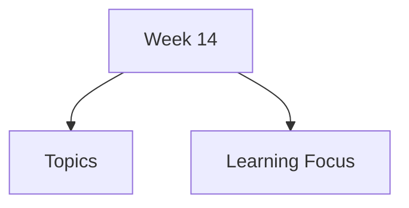

# Week 14

Week 14 covers evaluation methods, usability testing, analytical inspection, predictive models, reliability, validity, and ethics.

## Topics

- [Evaluation Basics](evaluation-basics/)
- [Iterative Evaluation](iterative-evaluation/)
- [Evaluation Methods](evaluation-methods/)
  - [Empirical Methods](evaluation-methods/empirical-methods/)
    - [Usability Testing](evaluation-methods/empirical-methods/usability-testing/)
    - [Field Studies](evaluation-methods/empirical-methods/field-studies/)
    - [A/B Testing](evaluation-methods/empirical-methods/ab-testing/)
  - [Analytical Methods](evaluation-methods/analytical-methods/)
    - [Heuristic Evaluation](evaluation-methods/analytical-methods/heuristic-evaluation/)
    - [Cognitive Walkthrough](evaluation-methods/analytical-methods/cognitive-walkthrough/)
    - [Fitts's Law](evaluation-methods/analytical-methods/fitts-law/)
    - [KLM & GOMS](evaluation-methods/analytical-methods/klm-goms/)
- [Good vs Bad UI Design](good-vs-bad-ui-design/)
- [Reliability & Validity](reliability-validity/)
- [User Consent & Ethics](user-consent-ethics/)

## Learning Focus

Choose suitable evaluation methods, distinguish empirical and analytical evidence, and evaluate designs ethically with reliable and valid methods.
