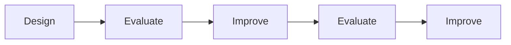

# Evaluation Basics

Evaluation is the process of assessing whether an interactive system meets user needs, supports usability goals, and delivers a positive user experience (UX). It acts as the bridge between design ideas and real-world use.

The purpose of evaluation is to determine:

- Whether users can complete tasks successfully
- Whether the system is easy to learn and use
- Whether users enjoy using the product
- Whether design goals and user requirements have been achieved

A design should not be evaluated only after development is complete. Evaluation should occur throughout the entire design lifecycle because problems discovered early are much cheaper and easier to fix than problems discovered after deployment.

The evaluation process is closely linked to iterative design:

Evaluation examines four main questions:

| Question | Purpose |
|-----------|----------|
| Why evaluate? | To verify user requirements, usability, and UX goals |
| What to evaluate? | Concepts, prototypes, interfaces, and finished products |
| Where to evaluate? | Laboratories, natural environments, or real-world settings |
| When to evaluate? | Throughout the entire design process |

## Why Evaluate?

Evaluation helps designers confirm that:

- The system supports user requirements
- Users can complete their tasks
- The interface is usable
- The overall experience is satisfactory

### Example

A university develops a new Learning Management System (LMS).

Evaluation may reveal that:

- Students cannot easily find assignment deadlines
- Navigation is confusing
- Important notifications are overlooked

These findings can be used to improve the system before large-scale deployment.

## What Can Be Evaluated?

Evaluation can be applied to:

- Early ideas and conceptual models
- Sketches and wireframes
- Low-fidelity prototypes
- High-fidelity prototypes
- Fully developed products
- Competitor products for comparison

### Example

Before creating a food delivery app, designers may evaluate paper sketches to see whether users understand the ordering process.

## Where Can Evaluation Take Place?

### Controlled Settings

Environments where researchers control tasks and conditions.

Examples:

- Usability laboratories
- Research labs
- Remote testing sessions

Benefits:

- Precise measurements
- Easier observation
- Controlled variables

### Natural Settings

Evaluation occurs in the environment where the product is normally used.

Examples:

- Homes
- Offices
- Streets
- Shopping malls

Benefits:

- Realistic user behavior
- Real-world context

### Example

Evaluating Google Maps while users walk through a city provides more realistic results than testing it in a laboratory.

## Living Labs

A living lab is a real-world environment where technology use is studied as part of everyday life.

Unlike traditional usability labs, users interact naturally with technology over extended periods.

Examples include:

- Smart homes
- Sensor-equipped buildings
- Smart cities
- Citizen science projects such as iNaturalist

### Example

The Aware Home project used sensors and recording devices throughout a house to study how people interacted with technology in daily life.

## Types of Evaluation Environments

| Environment | User Involvement | Level of Control |
|-------------|-----------------|------------------|
| Controlled Setting | Direct | High |
| Natural Setting | Direct | Low |
| Living Lab | Direct | Very Low |
| Expert Evaluation | No Users | High |

## Evaluation and Usability

A system may function correctly but still be difficult to use.

Evaluation therefore examines both:

### Usability

Focuses on:

- Effectiveness
- Efficiency
- Learnability
- Error prevention

### User Experience (UX)

Focuses on:

- Satisfaction
- Enjoyment
- Engagement
- Emotional response

### Example

A banking app may allow users to transfer money successfully (usable), but if the interface causes stress and confusion, the UX is poor.

## Why Continuous Evaluation Matters

Testing only at the end of development often results in:

- Expensive redesigns
- Increased development costs
- Delayed releases
- User dissatisfaction

Continuous evaluation helps detect issues early and supports iterative improvement throughout development.

### Example

Finding a navigation problem in a paper prototype may require a simple sketch modification.

Finding the same problem after deployment may require redesigning screens, rewriting code, and retraining users.
