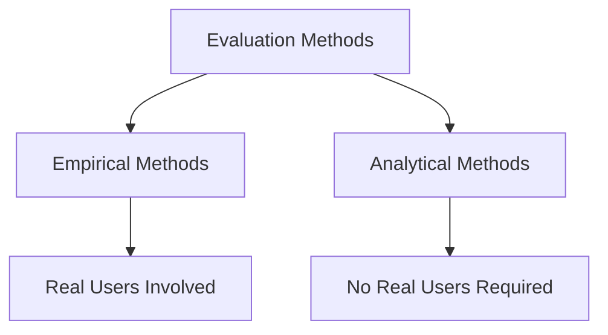

# Evaluation Methods

Evaluation methods are techniques used to assess the usability, effectiveness, efficiency, and user experience of an interactive system. Different methods are used depending on the stage of development, the goals of the evaluation, and the resources available.

Evaluation methods are generally divided into two major categories:

## Empirical Methods

Empirical methods involve real users interacting with a system while evaluators collect data about usability and user experience.

These methods focus on observing actual user behavior rather than predicting how users might behave.

Characteristics:

- Involve real users
- Collect quantitative and qualitative data
- Validate design decisions
- Measure real-world performance

Examples include:

- Usability Testing
- Field Studies
- A/B Testing
- Surveys
- Interviews
- Analytics and Logging

### Example

Users are asked to search for a product on an e-commerce website while researchers measure:

- Task completion
- Time taken
- Errors made
- User satisfaction

## Analytical Methods

Analytical methods evaluate an interface without involving real users. Instead, experts inspect the design or predictive models estimate user performance.

These methods are generally faster and less expensive than empirical methods and are especially useful during early design stages.

Characteristics:

- No users required
- Performed by experts or models
- Low cost
- Useful before implementation
- Helps identify potential usability issues early

Examples include:

- Heuristic Evaluation
- Cognitive Walkthrough
- Fitts's Law
- Keystroke-Level Model (KLM)
- GOMS

### Example

A usability expert reviews a mobile app and identifies that the loading process provides no feedback to users, violating usability principles before the app is released.

## Empirical vs Analytical Methods

| Aspect | Empirical Methods | Analytical Methods |
|----------|------------------|-------------------|
| Users Involved | Yes | No |
| Data Source | Real user behavior | Expert judgment or models |
| Cost | Higher | Lower |
| Design Stage | Mid to Late | Early to Mid |
| Purpose | Validate designs | Predict and identify problems |

Both categories complement each other. Analytical methods help find problems early, while empirical methods verify how real users actually interact with the system.
