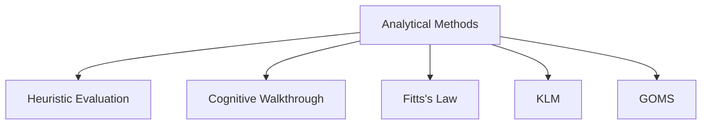

# Analytical Methods

Analytical Methods are evaluation methods that assess an interface without involving real users.

Instead of observing user behavior, experts inspect the design or predictive models estimate how users are likely to perform tasks.

These methods are generally faster, less expensive, and are especially useful during the early stages of design when prototypes may not yet be ready for user testing.

## Purpose

Analytical methods help answer questions such as:

- How efficient is a design?
- Which design alternative is better?
- How long will a task take?
- Are there obvious usability problems?

## Characteristics

- No real users required
- Performed by experts or models
- Low cost
- Fast evaluation
- Useful in early design stages

## Common Analytical Methods

## How Analytical Methods Complement Other Evaluations

Analytical methods can identify potential usability problems before user testing begins.

Experts provide qualitative judgments, while predictive models provide quantitative estimates of user performance.

### Example

An expert reviewing a video-sharing application may identify that slow loading pages provide no visible feedback to users, indicating a usability issue before the system is tested with real users.

## When to Use

Analytical methods are most useful:

- During early design stages
- When comparing design alternatives
- When quick and low-cost evaluation is needed
- Before conducting user-based testing

## Analytical vs Empirical Methods

| Analytical Methods | Empirical Methods |
|-------------------|------------------|
| No users required | Real users required |
| Expert inspection or prediction | Observation of actual behavior |
| Fast and low cost | More time and resources |
| Early design stages | Mid to late design stages |
| Predict usability issues | Validate usability issues |
