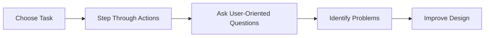

# Cognitive Walkthrough

A Cognitive Walkthrough is an analytical evaluation method in which evaluators step through a task from the perspective of a new user to determine whether the interface supports learning and task completion.

The evaluator simulates the actions a first-time user would take and examines whether the user can understand what to do at each step.

The primary focus of a cognitive walkthrough is **learnability**.

## Purpose

The goal is to determine whether a new user can successfully complete a task without prior training or experience.

Typical questions include:

- Will the user know what to do next?
- Will the user notice the correct action?
- Will the user understand the result of their action?

## Example

A first-time user signs up for Instagram.

The evaluator follows each step of the signup process and asks:

- Can the user find the sign-up option?
- Is the next action obvious?
- Does the interface provide enough guidance?

## Where Applied

- Task-based design evaluation
- Prototype reviews
- Interface inspections

## When to Use

Cognitive walkthroughs are most useful:

- During early design stages
- When evaluating learnability
- When designing for first-time users

## Characteristics

- No real users required
- Task-oriented evaluation
- Simulates a new user's thinking process
- Focuses on learnability
- Performed by evaluators or experts

