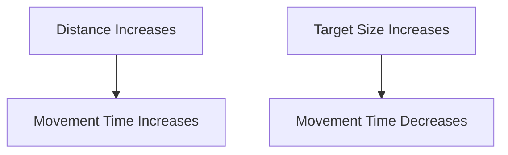
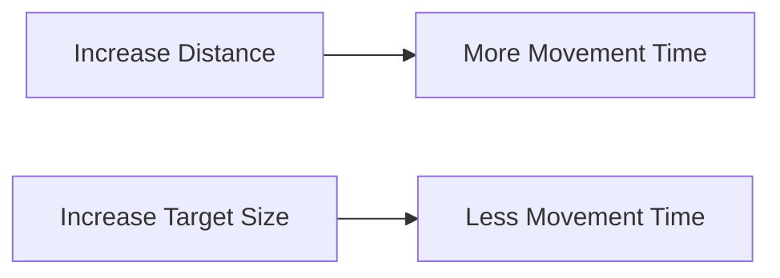

# Fitts’s Law



Fitts’s Law is a predictive model used to estimate how long it takes a user to move to and select a target on a user interface.

It predicts that selection time depends on:

- The distance to the target
- The size of the target

The farther away a target is, the longer it takes to reach.

The larger a target is, the easier and faster it is to select.

## Principle

## Formula

Fitts's Law estimates movement time using distance and target width:

$$
MT = a + b \log_2\left(\frac{D}{W} + 1\right)
$$

Where:

- \\(MT\\) = movement time
- \\(D\\) = distance from pointer/start position to target
- \\(W\\) = width of target along movement direction
- \\(a\\) = start/stop intercept from observed data
- \\(b\\) = slope from observed data

The index of difficulty is:

$$
ID = \log_2\left(\frac{D}{W} + 1\right)
$$

Throughput can be estimated as:

$$
TP = \frac{ID}{MT}
$$

## Purpose

Fitts's Law helps designers predict and improve the efficiency of user interactions.

It is commonly used when designing:

- Buttons
- Menus
- Icons
- Navigation controls
- Touch interfaces

## Design Rule

Important controls should be:

- Large enough to select easily
- Positioned where they can be reached quickly

## Example

Consider two buttons:

- A small button placed at the corner of the screen
- A large button placed near the center

According to Fitts's Law, the large button near the center can usually be selected faster.

## Applications

- Mobile app design
- Website navigation
- Touchscreen interfaces
- Accessibility design
- Button placement

## Characteristics

- Quantitative analytical method
- No users required
- Predicts movement time
- Helps improve interface efficiency

## Focus

| Factor | Effect |
|----------|---------|
| Distance Increases | Selection becomes slower |
| Target Size Increases | Selection becomes faster |
