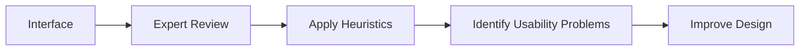

# Heuristic Evaluation

Heuristic Evaluation is an analytical evaluation method in which usability experts examine an interface using established usability principles, known as heuristics, to identify usability problems.

It does not require real users. Instead, experts inspect the interface and determine whether it follows recognized usability guidelines.

The most widely used heuristics are those developed by Jakob Nielsen.

## Purpose

The goal of heuristic evaluation is to identify usability issues quickly and inexpensively before testing with real users.

It helps answer questions such as:

- Does the interface follow usability principles?
- Are there obvious usability problems?
- What aspects of the design may confuse users?

## Example

An expert evaluates the search feature of YouTube.

Issue identified:

- No clear feedback is provided when the internet connection is slow.

This violates the heuristic:

- Visibility of System Status

## Where Applied

- Design reviews
- Expert inspections
- Prototype evaluation
- Interface reviews

## When to Use

Heuristic evaluation is most useful:

- During early design stages
- During mid-stage development
- Before usability testing
- When quick feedback is needed

## Characteristics

- No users required
- Performed by usability experts
- Based on usability principles
- Fast and low cost
- Identifies potential usability issues

